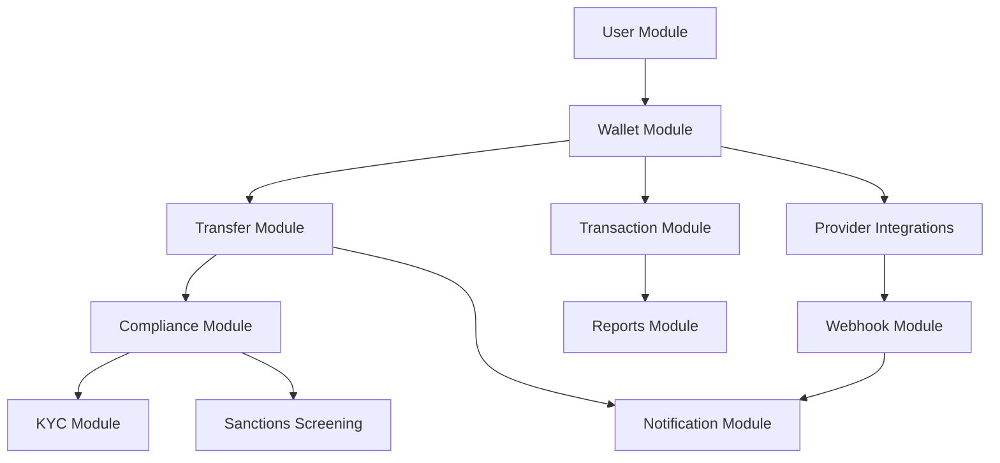

# JoonaPay Backend Modules

This document provides an overview of all backend modules in the JoonaPay USDC Wallet system.

## Table of Contents

1. [Core Modules](#core-modules)
2. [Financial Modules](#financial-modules)
3. [Compliance & Security](#compliance--security)
4. [Integration Modules](#integration-modules)
5. [Supporting Modules](#supporting-modules)

## Core Modules

### [Authentication & User Management](./modules/AUTH.md)
User registration, OTP verification, JWT token management, and session handling.

**Key Features:**
- Phone-based registration with OTP
- JWT + Refresh token authentication
- Session management across devices
- Username management

**Endpoints:** `/auth/*`, `/user/*`

### [Wallet Management](./modules/WALLET.md)
Core wallet operations including balance management, deposits, and withdrawals.

**Key Features:**
- Multi-currency wallet support
- Balance tracking (available, pending, total)
- Circle integration for blockchain wallets
- PIN-based transaction security

**Endpoints:** `/wallet/*`

### [Transfer Operations](./modules/TRANSFER.md)
Internal P2P transfers and external blockchain transfers.

**Key Features:**
- Internal transfers (user-to-user)
- External transfers (blockchain addresses)
- Idempotency support
- Real-time balance updates

**Endpoints:** `/transfers/*`

## Financial Modules

### Transaction Management
Transaction recording, history, and reconciliation.

**Key Features:**
- Double-entry ledger integration
- Transaction status tracking
- Historical queries
- Export capabilities

**Endpoints:** `/transactions/*`

### [Deposit & Withdrawal](./modules/WALLET.md#deposit-on-ramp)
Fiat on-ramp and off-ramp operations.

**Key Features:**
- Mobile money integration (Orange Money, MTN, Wave)
- Multi-channel support
- Real-time exchange rates
- Fee calculation

**Endpoints:** `/wallet/deposit/*`, `/wallet/withdraw/*`

### Bill Payments
Utility bill payments and merchant integrations.

**Key Features:**
- Multiple biller support
- Payment verification
- Receipt generation

**Endpoints:** `/bill-payments/*`

### Merchant Services
Merchant account management and payment processing.

**Key Features:**
- Merchant onboarding
- Payment links
- Settlement management

**Endpoints:** `/merchant/*`, `/payment-links/*`

## Compliance & Security

### [KYC Verification](./modules/COMPLIANCE.md#kyc-tiers)
Know Your Customer verification and tier management.

**Key Features:**
- Multi-tier KYC levels
- Document verification
- Liveness detection
- Transaction limits per tier

**Endpoints:** `/kyc/*`, `/wallet/kyc/*`

### [Compliance & AML/CFT](./modules/COMPLIANCE.md)
Anti-money laundering, compliance monitoring, and regulatory reporting.

**Key Features:**
- Velocity rules (transaction limits)
- Watchlist screening
- Suspicious activity reporting
- BCEAO regulatory compliance
- Fraud ring detection

**Endpoints:** `/compliance/*`

### [Sanctions Screening](./modules/SANCTIONS.md)
Real-time sanctions and PEP screening.

**Key Features:**
- OFAC, UN, EU sanctions lists
- PEP (Politically Exposed Persons) screening
- Ongoing monitoring
- Risk scoring

**Endpoints:** `/sanctions/*`

### Security & Risk
Device management, security monitoring, and risk assessment.

**Key Features:**
- Device fingerprinting
- Session management
- Anomaly detection
- Risk scoring

**Endpoints:** `/security/*`, `/device/*`

## Integration Modules

### [Webhook Management](./modules/WEBHOOK.md)
Incoming webhook processing from payment providers.

**Key Features:**
- Signature verification
- Idempotent processing
- Dead letter queue
- Automatic retry with exponential backoff

**Endpoints:** `/webhooks/*`

### [Notification System](./modules/NOTIFICATION.md)
Multi-channel notification delivery.

**Key Features:**
- Push notifications (FCM)
- In-app notifications
- Email notifications
- SMS notifications (Twilio)
- Template rendering

**Endpoints:** `/notifications/*`

### Provider Integrations
External service integrations.

**Providers:**
- **Blnk:** Ledger service
- **Circle:** Blockchain/USDC operations
- **Yellow Card:** Mobile money on-ramp
- **Twilio:** SMS/OTP delivery

**Location:** `/modules/providers/*`

## Supporting Modules

### API Keys
API key management for merchant integrations.

**Key Features:**
- Key generation and rotation
- Permission scopes
- Usage tracking

**Endpoints:** `/api-keys/*`

### Feature Flags
Feature toggle management for gradual rollouts.

**Key Features:**
- User-based flags
- Percentage-based rollouts
- A/B testing support

**Endpoints:** `/feature-flags/*`

### Session Management
User session tracking and management.

**Key Features:**
- Multi-device support
- Session invalidation
- Activity tracking

**Endpoints:** `/session/*`

### Beneficiary Management
Saved recipient management.

**Key Features:**
- Saved recipients
- Nickname support
- Quick transfers

**Endpoints:** `/beneficiaries/*`

### Contacts
Contact syncing and management.

**Key Features:**
- Phone contact sync
- Contact privacy

**Endpoints:** `/contacts/*`

### Reports & Analytics
Business intelligence and reporting.

**Key Features:**
- Transaction reports
- User analytics
- Compliance reports
- Export capabilities

**Endpoints:** `/reports/*`

### Data Retention
GDPR and data lifecycle management.

**Key Features:**
- Automated data archival
- Right to be forgotten
- Retention policies

**Endpoints:** `/data-retention/*`

### SLA Configuration
Service level agreement monitoring.

**Key Features:**
- SLA definition
- Performance tracking
- Alerting

**Endpoints:** `/sla/*`

### Legal & Terms
Legal document management.

**Key Features:**
- Terms of Service
- Privacy Policy
- User acceptance tracking

**Endpoints:** `/legal/*`

### Support
Customer support ticket management.

**Key Features:**
- Ticket creation
- Status tracking
- Priority management

**Endpoints:** `/support/*`

### Admin
Administrative operations and dashboards.

**Key Features:**
- User management
- System configuration
- Compliance dashboard

**Endpoints:** `/admin/*`

### Health & Monitoring
System health checks and monitoring.

**Key Features:**
- Health endpoints
- Dependency checks
- Metrics collection
- Prometheus integration

**Endpoints:** `/health/*`, `/metrics/*`

## Architecture Patterns

All modules follow Clean Architecture principles:

```
module/
├── application/           # Use cases, controllers, DTOs
├── domain/                # Business entities, interfaces
└── infrastructure/        # Implementation details
```

See [ARCHITECTURE.md](./ARCHITECTURE.md) for detailed architectural patterns.

## Module Dependencies



## Getting Started

1. Read [ARCHITECTURE.md](./ARCHITECTURE.md) to understand the system design
2. Explore individual module documentation in `/docs/modules/`
3. Review API endpoints in Swagger: `http://localhost:3000/api`
4. Check configuration in `.env.example`

## Module Status

| Module | Status | Coverage | Documentation |
|--------|--------|----------|---------------|
| Authentication | Production | 85% | Complete |
| Wallet | Production | 80% | Complete |
| Transfer | Production | 82% | Complete |
| Compliance | Production | 78% | Complete |
| KYC | Production | 75% | Complete |
| Webhook | Production | 88% | Complete |
| Notification | Production | 70% | Complete |
| Sanctions | Production | 80% | Complete |
| Merchant | Beta | 65% | In Progress |
| Bill Payments | Beta | 60% | In Progress |
| Reports | Alpha | 50% | Planned |

## Contributing

When adding new modules:

1. Follow the Clean Architecture pattern
2. Add comprehensive tests (target 80%+ coverage)
3. Document API endpoints with Swagger
4. Create module documentation in `/docs/modules/`
5. Update this overview document
6. Add integration tests

## Support

For questions or issues:
- Technical: See individual module documentation
- Architecture: See [ARCHITECTURE.md](./ARCHITECTURE.md)
- API: Check Swagger documentation
