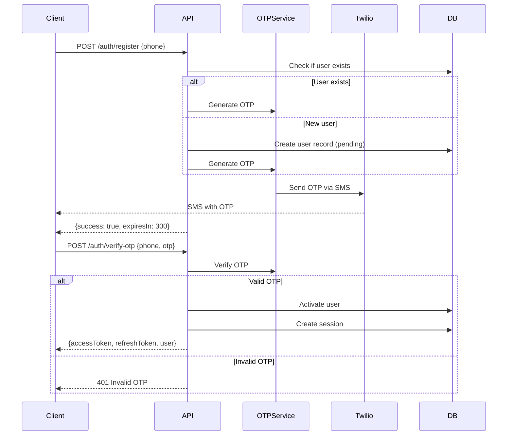
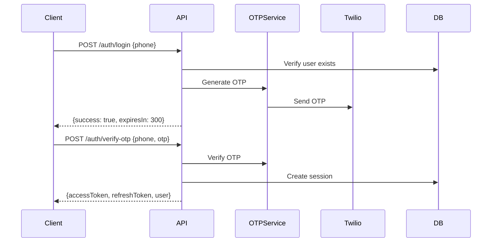
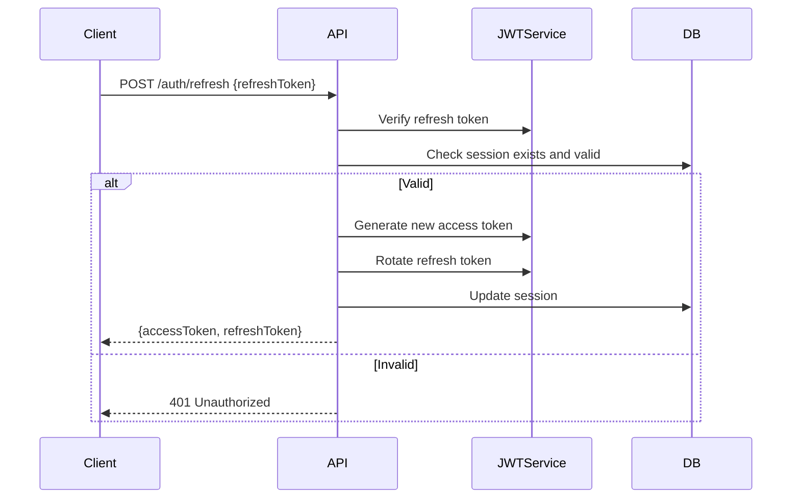

# Authentication & User Management Module

## Overview

The Authentication module handles user registration, login, session management, and profile management for the JoonaPay USDC Wallet. It uses phone-based authentication with OTP verification and JWT tokens for session management.

## Purpose

- Secure user registration and onboarding
- Phone-based authentication (passwordless)
- Session management across multiple devices
- User profile management
- Username system for easy user discovery

## Key Entities

### User (Domain Entity)
```typescript
class User {
  id: string;
  phone: string;
  countryCode: string;
  username?: string;
  firstName?: string;
  lastName?: string;
  email?: string;
  kycStatus: KycStatus;
  createdAt: Date;
  updatedAt: Date;
}
```

### Session (Domain Entity)
```typescript
class Session {
  id: string;
  userId: string;
  refreshTokenHash: string;
  deviceInfo: DeviceInfo;
  lastActivityAt: Date;
  expiresAt: Date;
  createdAt: Date;
}
```

### OTP (Value Object)
```typescript
class OTP {
  code: string;
  phone: string;
  expiresAt: Date;
  attempts: number;
}
```

## Authentication Flow

### 1. Registration Flow



### 2. Login Flow



### 3. Token Refresh Flow



## API Endpoints

### Authentication Endpoints

#### Register User
```http
POST /auth/register
Content-Type: application/json

{
  "phone": "+2250701234567",
  "countryCode": "CI"
}
```

**Response:**
```json
{
  "success": true,
  "message": "OTP sent successfully. Please verify your phone number.",
  "expiresIn": 300
}
```

**Rate Limit:** 5 requests per minute
**Purpose:** Initiate user registration and send OTP

---

#### Verify OTP
```http
POST /auth/verify-otp
Content-Type: application/json

{
  "phone": "+2250701234567",
  "otp": "123456"
}
```

**Response:**
```json
{
  "accessToken": "eyJhbGciOiJIUzI1NiIs...",
  "refreshToken": "eyJhbGciOiJIUzI1NiIs...",
  "user": {
    "id": "123e4567-e89b-12d3-a456-426614174000",
    "phone": "+2250701234567",
    "username": null,
    "kycStatus": "none"
  },
  "kycStatus": "none"
}
```

**Rate Limit:** 5 requests per minute (OTP brute-force protection)
**Errors:**
- `401`: Invalid or expired OTP
- `423`: Too many failed attempts (account locked)

---

#### Login (Request OTP)
```http
POST /auth/login
Content-Type: application/json

{
  "phone": "+2250701234567"
}
```

**Response:**
```json
{
  "success": true,
  "message": "OTP sent successfully",
  "expiresIn": 300
}
```

**Rate Limit:** 5 requests per minute

---

#### Refresh Access Token
```http
POST /auth/refresh
Content-Type: application/json

{
  "refreshToken": "eyJhbGciOiJIUzI1NiIs..."
}
```

**Response:**
```json
{
  "accessToken": "eyJhbGciOiJIUzI1NiIs...",
  "refreshToken": "eyJhbGciOiJIUzI1NiIs..." // New rotated token
}
```

**Rate Limit:** 10 requests per minute
**Errors:**
- `401`: Invalid or expired refresh token

---

#### Logout
```http
POST /auth/logout
Authorization: Bearer {accessToken}
Content-Type: application/json

{
  "refreshToken": "eyJhbGciOiJIUzI1NiIs..."
}
```

**Response:**
```json
{
  "success": true,
  "message": "Logged out successfully"
}
```

**Purpose:** Invalidate a single session (current device)

---

#### Logout All Devices
```http
POST /auth/logout-all
Authorization: Bearer {accessToken}
Content-Type: application/json

{
  "currentRefreshToken": "eyJhbGciOiJIUzI1NiIs..." // Optional
}
```

**Response:**
```json
{
  "success": true,
  "message": "Logged out from all devices",
  "sessionsInvalidated": 3
}
```

**Rate Limit:** 3 requests per minute
**Purpose:** Invalidate all sessions except optionally the current one

---

### User Profile Endpoints

#### Get Profile
```http
GET /user/profile
Authorization: Bearer {accessToken}
```

**Response:**
```json
{
  "id": "123e4567-e89b-12d3-a456-426614174000",
  "phone": "+2250701234567",
  "username": "john_doe",
  "firstName": "John",
  "lastName": "Doe",
  "email": "john@example.com",
  "kycStatus": "verified",
  "createdAt": "2026-01-15T10:00:00.000Z"
}
```

---

#### Update Profile
```http
PUT /user/profile
Authorization: Bearer {accessToken}
Content-Type: application/json

{
  "username": "john_doe",
  "firstName": "John",
  "lastName": "Doe",
  "email": "john@example.com"
}
```

**Response:** Same as Get Profile

**Validation:**
- Username: 3-20 characters, alphanumeric + underscore
- Email: Valid email format
- Names: 1-50 characters

**Errors:**
- `409`: Username already taken

---

#### Check Username Availability
```http
GET /user/username/check/john_doe
Authorization: Bearer {accessToken}
```

**Response:**
```json
{
  "available": true,
  "username": "john_doe"
}
```

---

#### Search Users by Username
```http
GET /user/username/search?query=john&limit=10
Authorization: Bearer {accessToken}
```

**Response:**
```json
{
  "users": [
    {
      "id": "...",
      "username": "john_doe",
      "firstName": "John",
      "lastName": "Doe"
    }
  ],
  "count": 1
}
```

**Purpose:** Find users for P2P transfers

---

#### Find User by Username
```http
GET /user/by-username/@john_doe
Authorization: Bearer {accessToken}
```

**Response:**
```json
{
  "id": "123e4567-e89b-12d3-a456-426614174000",
  "username": "john_doe",
  "firstName": "John",
  "lastName": "Doe"
}
```

---

#### Get User Transaction Limits
```http
GET /user/limits
Authorization: Bearer {accessToken}
```

**Response:**
```json
{
  "kycStatus": "tier_2",
  "limits": {
    "dailyTransactionLimit": 1000000,
    "monthlyTransactionLimit": 5000000,
    "singleTransactionLimit": 500000,
    "currency": "XOF"
  },
  "usage": {
    "dailyUsed": 250000,
    "monthlyUsed": 800000,
    "currency": "XOF"
  }
}
```

## Events Emitted

### user.registered
Emitted when a new user completes registration.

```typescript
{
  userId: string;
  phone: string;
  countryCode: string;
  timestamp: Date;
}
```

**Listeners:**
- Create default wallet
- Send welcome notification
- Initialize feature flags

---

### user.logged_in
Emitted on successful login.

```typescript
{
  userId: string;
  sessionId: string;
  deviceInfo: DeviceInfo;
  timestamp: Date;
}
```

**Listeners:**
- Update last login timestamp
- Security monitoring

---

### user.profile_updated
Emitted when user updates their profile.

```typescript
{
  userId: string;
  changes: Record<string, any>;
  timestamp: Date;
}
```

---

### session.created
Emitted when a new session is created.

```typescript
{
  sessionId: string;
  userId: string;
  deviceInfo: DeviceInfo;
  timestamp: Date;
}
```

---

### session.invalidated
Emitted when session is logged out.

```typescript
{
  sessionId: string;
  userId: string;
  reason: 'logout' | 'expired' | 'security';
  timestamp: Date;
}
```

## Dependencies

### Internal Dependencies
- **KYC Module:** Get user KYC status for limits
- **Wallet Module:** Create wallet on registration
- **Notification Module:** Send welcome messages

### External Dependencies
- **Twilio:** OTP SMS delivery
- **Redis:** OTP storage and rate limiting
- **PostgreSQL:** User and session persistence

## Configuration

### Environment Variables

```env
# JWT Configuration
JWT_SECRET=your-secret-key
JWT_EXPIRES_IN=15m
REFRESH_TOKEN_EXPIRES_IN=7d

# OTP Configuration
OTP_LENGTH=6
OTP_EXPIRES_IN=300  # 5 minutes
OTP_MAX_ATTEMPTS=5

# Twilio (OTP Delivery)
TWILIO_ACCOUNT_SID=ACxxxxx
TWILIO_AUTH_TOKEN=xxxxx
TWILIO_PHONE_NUMBER=+1234567890

# Rate Limiting
REGISTER_RATE_LIMIT=5  # per minute
LOGIN_RATE_LIMIT=5     # per minute
REFRESH_RATE_LIMIT=10  # per minute
```

### Security Settings

```typescript
const securityConfig = {
  otp: {
    length: 6,
    expiresIn: 300, // 5 minutes
    maxAttempts: 5,
    lockoutDuration: 1800, // 30 minutes
  },
  jwt: {
    accessTokenExpiry: '15m',
    refreshTokenExpiry: '7d',
  },
  session: {
    maxActiveSessions: 5,
    inactivityTimeout: 2592000, // 30 days
  },
  rateLimit: {
    register: { ttl: 60000, limit: 5 },
    login: { ttl: 60000, limit: 5 },
    verifyOtp: { ttl: 60000, limit: 5 },
  },
};
```

## Security Considerations

### OTP Security
1. **Rate Limiting:** Max 5 OTP requests per minute per phone
2. **Attempt Limiting:** Max 5 verification attempts per OTP
3. **Expiration:** OTPs expire after 5 minutes
4. **Lockout:** Account locked for 30 minutes after 5 failed attempts
5. **No OTP Reuse:** Each OTP can only be used once

### Token Security
1. **Short Access Tokens:** 15-minute expiry
2. **Refresh Token Rotation:** New refresh token on each use
3. **Secure Storage:** Refresh tokens hashed in database (bcrypt)
4. **Token Invalidation:** Support for logout and logout-all
5. **JWT Best Practices:** Include user ID, phone, and expiry

### Session Security
1. **Device Fingerprinting:** Track device information
2. **Session Limits:** Max 5 concurrent sessions per user
3. **Inactivity Timeout:** Sessions expire after 30 days of inactivity
4. **Audit Trail:** Log all session creation/deletion events

### Username Security
1. **Validation:** Alphanumeric + underscore only
2. **Length:** 3-20 characters
3. **Uniqueness:** Case-insensitive unique constraint
4. **No Reserved Words:** Block common/reserved usernames
5. **Profanity Filter:** (Optional) Prevent offensive usernames

## Error Codes

| Code | HTTP | Description | Recovery |
|------|------|-------------|----------|
| `PHONE_REQUIRED` | 400 | Phone number is required | Provide valid phone |
| `INVALID_PHONE` | 400 | Invalid phone format | Check format (+225...) |
| `OTP_REQUIRED` | 400 | OTP code is required | Provide OTP |
| `INVALID_OTP` | 401 | OTP is invalid or expired | Request new OTP |
| `OTP_EXPIRED` | 401 | OTP has expired | Request new OTP |
| `TOO_MANY_ATTEMPTS` | 423 | Too many failed OTP attempts | Wait for lockout period |
| `USER_NOT_FOUND` | 404 | User does not exist | Register first |
| `USER_ALREADY_EXISTS` | 409 | User already registered | Login instead |
| `USERNAME_TAKEN` | 409 | Username already in use | Choose different username |
| `INVALID_USERNAME` | 400 | Username format invalid | Check username rules |
| `INVALID_REFRESH_TOKEN` | 401 | Refresh token invalid/expired | Login again |
| `SESSION_NOT_FOUND` | 404 | Session does not exist | Login again |
| `SESSION_EXPIRED` | 401 | Session has expired | Login again |
| `RATE_LIMIT_EXCEEDED` | 429 | Too many requests | Wait and retry |

## Performance Considerations

### Caching Strategy
- **User profiles:** Cache for 5 minutes after lookup
- **Username availability:** Cache positive results for 1 minute
- **Session lookups:** Cache session data in Redis

### Database Optimization
- **Indexes:**
  - `users(phone)` - UNIQUE
  - `users(username)` - UNIQUE, case-insensitive
  - `sessions(userId, expiresAt)`
  - `sessions(refreshTokenHash)`

### OTP Storage
- Store OTPs in Redis with TTL for automatic expiration
- Key format: `otp:{phone}` → `{code, expiresAt, attempts}`

## Testing

### Unit Tests
```typescript
describe('User Entity', () => {
  it('should validate username format', () => {
    const user = new User(...);
    expect(() => user.updateUsername('john_doe')).not.toThrow();
    expect(() => user.updateUsername('john@doe')).toThrow(InvalidUsernameException);
  });
});
```

### Integration Tests
```typescript
describe('RegisterUserUseCase', () => {
  it('should send OTP and create user', async () => {
    const result = await useCase.execute({
      phone: '+2250701234567',
      countryCode: 'CI',
    });

    expect(result.otpExpiresIn).toBe(300);
    expect(twilioService.sendOtp).toHaveBeenCalled();
  });
});
```

### E2E Tests
```typescript
describe('Auth (E2E)', () => {
  it('should complete registration flow', async () => {
    // Register
    const registerRes = await request(app)
      .post('/auth/register')
      .send({ phone: '+2250701234567' })
      .expect(201);

    // Verify OTP
    const verifyRes = await request(app)
      .post('/auth/verify-otp')
      .send({ phone: '+2250701234567', otp: '123456' })
      .expect(200);

    expect(verifyRes.body.accessToken).toBeDefined();
  });
});
```

## Monitoring & Alerts

### Metrics to Track
- OTP delivery success rate
- OTP verification success rate
- Average OTP verification time
- Failed login attempts (potential attacks)
- Token refresh rate
- Active sessions per user

### Alerts
- **High OTP failure rate:** > 50% failures
- **Unusual OTP volume:** > 1000 OTPs/hour
- **Failed login attempts:** > 100/hour from single IP
- **Session creation spike:** > 500 new sessions/minute

## Future Enhancements

1. **Biometric Authentication:** Face ID / Touch ID support
2. **Social Login:** Google, Apple Sign-In
3. **Email OTP:** Alternative to SMS
4. **2FA:** Optional second factor for high-risk operations
5. **Password Option:** Optional password login alongside OTP
6. **Account Recovery:** Forgot phone number flow
7. **Email Verification:** Verify email addresses
8. **Profile Photos:** Avatar upload support
9. **Account Deletion:** GDPR-compliant account deletion
10. **Login History:** View recent login activity

## Related Documentation

- [Wallet Module](./WALLET.md)
- [Compliance Module](./COMPLIANCE.md)
- [Notification Module](./NOTIFICATION.md)
- [Architecture Overview](../ARCHITECTURE.md)
