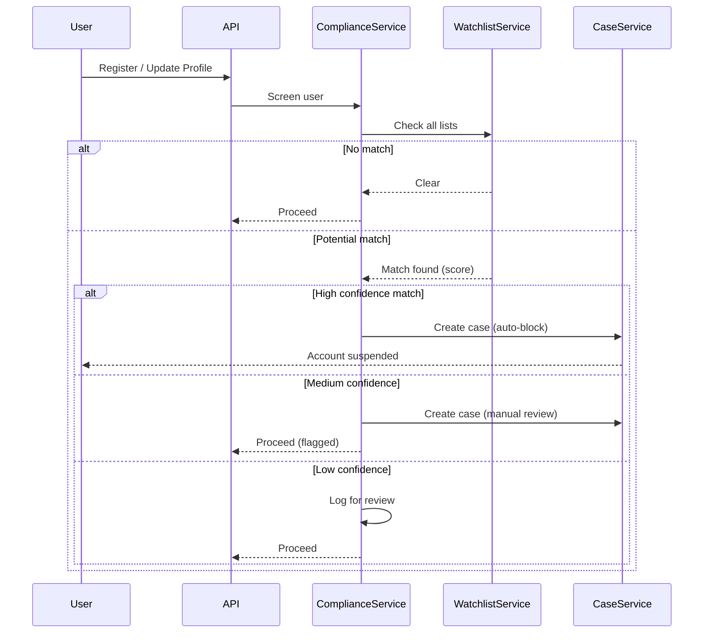

# Compliance & AML/CFT Module

## Overview

The Compliance module ensures regulatory compliance for JoonaPay operations, including KYC (Know Your Customer) verification, transaction limits, velocity rules, watchlist screening, suspicious activity reporting, and BCEAO (West African Central Bank) regulatory requirements.

## Purpose

- Enforce KYC verification and tier-based limits
- Monitor transaction patterns for suspicious activity
- Screen users and transactions against watchlists
- Generate regulatory reports (SAR, BCEAO)
- Detect fraud rings and coordinated activity
- Maintain compliance case management

## Key Entities

### KYC Submission
```typescript
class KycSubmission {
  id: string;
  userId: string;
  tier: KycTier;                  // tier_0, tier_1, tier_2
  status: KycStatus;              // pending, verified, rejected

  // Personal information
  firstName: string;
  lastName: string;
  dateOfBirth: Date;
  nationality: string;

  // Identification
  idType: string;                 // national_id, passport, drivers_license
  idNumber: string;
  idExpiryDate: Date;

  // Address
  address: string;
  city: string;
  country: string;
  postalCode?: string;

  // Documents
  documentFrontUrl: string;
  documentBackUrl: string;
  selfieUrl: string;
  livenessScore?: number;

  // Verification
  verifiedAt?: Date;
  rejectedAt?: Date;
  rejectionReason?: string;
  verifiedBy?: string;            // Admin user ID

  createdAt: Date;
  updatedAt: Date;
}
```

### Velocity Rule
```typescript
class VelocityRule {
  id: string;
  name: string;
  description: string;
  enabled: boolean;

  // Rule configuration
  ruleType: VelocityRuleType;     // transaction_count, transaction_amount
  timeWindow: number;             // in seconds (e.g., 86400 for 24h)
  maxCount?: number;              // max transactions in window
  maxAmount?: number;             // max total amount in window

  // Scope
  userTier?: KycTier;             // Apply to specific tier
  transactionType?: string;       // Apply to specific type

  // Action
  action: VelocityAction;         // block, flag, alert

  createdAt: Date;
  updatedAt: Date;
}
```

### Compliance Case
```typescript
class ComplianceCase {
  id: string;
  userId: string;
  caseType: CaseType;             // suspicious_activity, velocity_breach, watchlist_match
  status: CaseStatus;             // open, investigating, resolved, escalated
  severity: CaseSeverity;         // low, medium, high, critical

  // Case details
  title: string;
  description: string;
  riskScore: number;              // 0-100

  // Related data
  relatedTransactions: string[];
  relatedUsers: string[];
  evidences: CaseEvidence[];
  notes: CaseNote[];

  // Resolution
  assignedTo?: string;
  resolvedAt?: Date;
  resolution?: string;

  createdAt: Date;
  updatedAt: Date;
}
```

### Watchlist Entry
```typescript
class WatchlistEntry {
  id: string;
  name: string;
  listType: WatchlistType;        // ofac, un, eu, pep, internal
  riskLevel: RiskLevel;           // low, medium, high, critical

  // Identity information
  aliases: string[];
  dateOfBirth?: Date;
  nationality?: string;
  idNumbers: string[];

  // Additional info
  reason: string;
  source: string;

  // Metadata
  addedAt: Date;
  updatedAt: Date;
  expiresAt?: Date;
}
```

## KYC Tiers and Limits

### Tier 0: Unverified
**Requirements:** Phone number verification only

**Limits:**
```typescript
{
  singleTransaction: 10000,        // $100
  dailyTransfer: 50000,            // $500
  monthlyTransfer: 200000,         // $2,000
  walletBalance: 200000,           // $2,000
  features: {
    internalTransfers: true,
    externalTransfers: false,
    deposits: true,
    withdrawals: false,
    merchantPayments: true,
  }
}
```

---

### Tier 1: Basic KYC
**Requirements:**
- Full name
- Date of birth
- National ID or Passport
- Selfie with liveness check
- Residential address

**Limits:**
```typescript
{
  singleTransaction: 100000,       // $1,000
  dailyTransfer: 500000,           // $5,000
  monthlyTransfer: 2000000,        // $20,000
  walletBalance: 5000000,          // $50,000
  features: {
    internalTransfers: true,
    externalTransfers: true,       // Limited
    deposits: true,
    withdrawals: true,
    merchantPayments: true,
    billPayments: true,
  }
}
```

---

### Tier 2: Full KYC
**Requirements:**
- All Tier 1 requirements
- Proof of address (utility bill, bank statement)
- Source of funds declaration
- Enhanced due diligence

**Limits:**
```typescript
{
  singleTransaction: 1000000,      // $10,000
  dailyTransfer: 5000000,          // $50,000
  monthlyTransfer: 20000000,       // $200,000
  walletBalance: 50000000,         // $500,000
  features: {
    internalTransfers: true,
    externalTransfers: true,       // Full access
    deposits: true,
    withdrawals: true,
    merchantPayments: true,
    billPayments: true,
    apiAccess: true,               // Merchant API
    recurringPayments: true,
  }
}
```

## Velocity Rules

### Default Rules

#### Daily Transaction Count
```typescript
{
  name: 'Daily Transaction Limit',
  ruleType: 'transaction_count',
  timeWindow: 86400,              // 24 hours
  maxCount: 50,
  action: 'block',
}
```

#### Hourly Large Transactions
```typescript
{
  name: 'Hourly Large Transaction Alert',
  ruleType: 'transaction_amount',
  timeWindow: 3600,               // 1 hour
  maxAmount: 500000,              // $5,000
  action: 'flag',
}
```

#### Daily Withdrawal Limit
```typescript
{
  name: 'Daily Withdrawal Limit',
  ruleType: 'transaction_amount',
  timeWindow: 86400,
  maxAmount: 1000000,             // $10,000
  action: 'block',
  transactionType: 'withdrawal',
}
```

## Watchlist Screening

### Screening Process



### Screening Criteria
- **Name matching:** Fuzzy matching with soundex
- **Date of birth:** Exact or close matches
- **Nationality:** Country-based screening
- **ID numbers:** Exact matching

### Match Scoring
```typescript
const calculateMatchScore = (user: User, entry: WatchlistEntry): number => {
  let score = 0;

  // Name match (0-70 points)
  score += nameMatchScore(user.name, entry.name, entry.aliases);

  // DOB match (0-20 points)
  if (user.dateOfBirth === entry.dateOfBirth) score += 20;

  // Nationality match (0-10 points)
  if (user.nationality === entry.nationality) score += 10;

  return score; // 0-100
};

// Score interpretation:
// 90-100: High confidence match → Block immediately
// 70-89:  Medium confidence → Manual review
// 50-69:  Low confidence → Log and monitor
// 0-49:   No significant match
```

## BCEAO Regulatory Compliance

### BCEAO Reporting Requirements

#### Transaction Report (Weekly)
```typescript
interface BceaoTransactionReport {
  reportingPeriod: {
    startDate: Date;
    endDate: Date;
  };
  summary: {
    totalTransactions: number;
    totalVolume: number;
    currency: string;
  };
  breakdown: {
    internalTransfers: { count: number; volume: number };
    externalTransfers: { count: number; volume: number };
    deposits: { count: number; volume: number };
    withdrawals: { count: number; volume: number };
  };
  largeTransactions: Array<{
    id: string;
    amount: number;
    type: string;
    date: Date;
  }>;
}
```

#### User Report (Monthly)
```typescript
interface BceaoUserReport {
  reportingPeriod: {
    month: number;
    year: number;
  };
  userStatistics: {
    totalUsers: number;
    newUsers: number;
    activeUsers: number;
    verifiedUsers: number;
  };
  kycBreakdown: {
    tier0: number;
    tier1: number;
    tier2: number;
  };
}
```

#### Suspicious Activity Report (As needed)
```typescript
interface SuspiciousActivityReport {
  reportId: string;
  reportDate: Date;
  userId: string;
  suspiciousActivities: Array<{
    type: string;
    description: string;
    amount?: number;
    date: Date;
    evidence: string[];
  }>;
  investigationSummary: string;
  recommendation: string;
}
```

## API Endpoints

### KYC Management

#### Submit KYC
```http
POST /kyc/submit
Authorization: Bearer {accessToken}
Content-Type: application/json

{
  "tier": "tier_1",
  "firstName": "John",
  "lastName": "Doe",
  "dateOfBirth": "1990-01-15",
  "nationality": "CI",
  "idType": "national_id",
  "idNumber": "CI12345678",
  "idExpiryDate": "2030-01-15",
  "address": "123 Main St",
  "city": "Abidjan",
  "country": "CI",
  "documentFrontKey": "s3-key-front",
  "documentBackKey": "s3-key-back",
  "selfieKey": "s3-key-selfie"
}
```

**Response:**
```json
{
  "id": "kyc-123",
  "userId": "user-123",
  "tier": "tier_1",
  "status": "pending",
  "submittedAt": "2026-01-29T12:00:00.000Z",
  "estimatedProcessingTime": "24-48 hours"
}
```

---

#### Get KYC Status
```http
GET /kyc/status
Authorization: Bearer {accessToken}
```

**Response:**
```json
{
  "userId": "user-123",
  "currentTier": "tier_1",
  "status": "verified",
  "verifiedAt": "2026-01-20T10:00:00.000Z",
  "limits": {
    "singleTransaction": 100000,
    "dailyTransfer": 500000,
    "monthlyTransfer": 2000000,
    "walletBalance": 5000000
  }
}
```

---

### Compliance Cases (Admin)

#### List Compliance Cases
```http
GET /compliance/cases?status=open&severity=high
Authorization: Bearer {adminToken}
```

**Response:**
```json
{
  "data": [
    {
      "id": "case-123",
      "userId": "user-456",
      "caseType": "watchlist_match",
      "status": "investigating",
      "severity": "high",
      "riskScore": 85,
      "title": "Potential OFAC match",
      "createdAt": "2026-01-29T10:00:00.000Z",
      "assignedTo": "admin-789"
    }
  ],
  "pagination": {
    "total": 15,
    "limit": 20,
    "offset": 0
  }
}
```

---

#### Create Compliance Case
```http
POST /compliance/cases
Authorization: Bearer {adminToken}
Content-Type: application/json

{
  "userId": "user-123",
  "caseType": "suspicious_activity",
  "severity": "medium",
  "title": "Unusual transaction pattern",
  "description": "Multiple large transactions in short period",
  "relatedTransactions": ["txn-1", "txn-2", "txn-3"]
}
```

---

#### Update Compliance Case
```http
PUT /compliance/cases/{caseId}
Authorization: Bearer {adminToken}
Content-Type: application/json

{
  "status": "resolved",
  "resolution": "False positive - legitimate business activity",
  "assignedTo": "admin-456"
}
```

---

### Velocity Rules (Admin)

#### List Velocity Rules
```http
GET /compliance/velocity-rules
Authorization: Bearer {adminToken}
```

**Response:**
```json
{
  "data": [
    {
      "id": "rule-1",
      "name": "Daily Transaction Limit",
      "enabled": true,
      "ruleType": "transaction_count",
      "timeWindow": 86400,
      "maxCount": 50,
      "action": "block"
    }
  ]
}
```

---

#### Create Velocity Rule
```http
POST /compliance/velocity-rules
Authorization: Bearer {adminToken}
Content-Type: application/json

{
  "name": "Hourly Withdrawal Limit",
  "description": "Limit withdrawals per hour",
  "ruleType": "transaction_amount",
  "timeWindow": 3600,
  "maxAmount": 200000,
  "action": "block",
  "transactionType": "withdrawal"
}
```

---

### Watchlist Management (Admin)

#### Screen User
```http
POST /compliance/watchlist/screen
Authorization: Bearer {adminToken}
Content-Type: application/json

{
  "userId": "user-123"
}
```

**Response:**
```json
{
  "userId": "user-123",
  "matches": [
    {
      "watchlistEntryId": "entry-456",
      "listType": "ofac",
      "matchScore": 75,
      "confidence": "medium",
      "details": {
        "nameMatch": true,
        "dobMatch": false,
        "nationalityMatch": true
      }
    }
  ],
  "recommendation": "manual_review"
}
```

---

## Events Emitted

### kyc.submitted
```typescript
{
  userId: string;
  tier: KycTier;
  timestamp: Date;
}
```

### kyc.verified
```typescript
{
  userId: string;
  tier: KycTier;
  verifiedBy: string;
  timestamp: Date;
}
```

### kyc.rejected
```typescript
{
  userId: string;
  tier: KycTier;
  reason: string;
  timestamp: Date;
}
```

### compliance.case_created
```typescript
{
  caseId: string;
  userId: string;
  caseType: CaseType;
  severity: CaseSeverity;
  timestamp: Date;
}
```

### compliance.velocity_breach
```typescript
{
  userId: string;
  ruleId: string;
  ruleName: string;
  action: VelocityAction;
  timestamp: Date;
}
```

### compliance.watchlist_match
```typescript
{
  userId: string;
  matchScore: number;
  listType: WatchlistType;
  action: string;
  timestamp: Date;
}
```

---

## Dependencies

### Internal Modules
- **User Module:** User profile data
- **Wallet Module:** Transaction data
- **Transfer Module:** Transfer monitoring
- **Notification Module:** Compliance alerts

### External Services
- **Trulioo/Smile ID:** Identity verification
- **ComplyAdvantage:** Watchlist screening
- **AWS S3:** Document storage
- **BCEAO API:** Regulatory reporting

---

## Configuration

```env
# KYC Settings
KYC_AUTO_APPROVE_TIER_1=false
KYC_LIVENESS_THRESHOLD=0.85
KYC_DOCUMENT_EXPIRY_WARNING_DAYS=30

# Velocity Rules
ENABLE_VELOCITY_RULES=true
DAILY_TX_COUNT_LIMIT=50
HOURLY_LARGE_TX_LIMIT=500000

# Watchlist Screening
ENABLE_WATCHLIST_SCREENING=true
WATCHLIST_MATCH_THRESHOLD=70
AUTO_BLOCK_THRESHOLD=90

# BCEAO Reporting
BCEAO_REPORTING_ENABLED=true
BCEAO_REPORT_SCHEDULE='0 0 * * 1'  # Weekly on Monday
BCEAO_API_ENDPOINT=https://bceao.example.com/api
BCEAO_API_KEY=...

# Compliance Case Management
CASE_AUTO_ASSIGN=true
CASE_SLA_HOURS=48
HIGH_RISK_ALERT_WEBHOOK=...
```

---

## Security Considerations

1. **Data Encryption:** PII encrypted at rest and in transit
2. **Access Control:** Role-based access for compliance data
3. **Audit Trail:** All compliance actions logged
4. **Document Security:** KYC documents in encrypted S3 buckets
5. **Data Retention:** Comply with GDPR and local regulations

---

## Future Enhancements

1. **AI/ML Fraud Detection:** Machine learning for pattern detection
2. **Real-time Transaction Monitoring:** Live risk scoring
3. **Enhanced Due Diligence:** Automated EDD workflows
4. **Biometric Verification:** Face recognition, fingerprints
5. **Blockchain Analysis:** Track crypto source of funds
6. **Compliance Dashboard:** Real-time compliance metrics
7. **Automated Reporting:** Auto-generate regulatory reports
8. **Risk-Based Authentication:** Dynamic security based on risk

---

## Related Documentation

- [Auth Module](./AUTH.md)
- [Wallet Module](./WALLET.md)
- [Sanctions Screening](./SANCTIONS.md)
- [Architecture Overview](../ARCHITECTURE.md)
