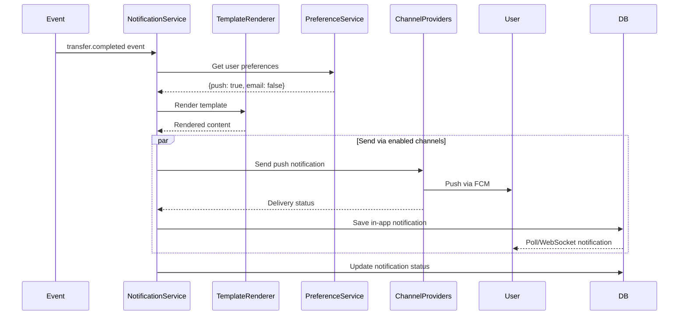

# Notification Module

## Overview

The Notification module provides multi-channel notification delivery for JoonaPay, including push notifications (FCM), in-app notifications, email, and SMS. It supports templated messages, delivery tracking, and user preference management.

## Purpose

- Send transactional notifications (transfers, deposits, etc.)
- Deliver marketing and promotional messages
- Manage notification preferences
- Track delivery status and read receipts
- Support multiple channels (push, in-app, email, SMS)
- Template-based notification rendering

## Key Entities

### Notification (Domain Entity)
```typescript
class Notification {
  id: string;
  userId: string;
  type: NotificationType;
  channel: NotificationChannel;    // push, in_app, email, sms
  status: NotificationStatus;      // pending, sent, delivered, failed, read

  // Content
  title: string;
  body: string;
  data?: Record<string, any>;
  imageUrl?: string;
  actionUrl?: string;

  // Delivery
  sentAt?: Date;
  deliveredAt?: Date;
  readAt?: Date;
  failedAt?: Date;
  failureReason?: string;

  // Metadata
  priority: NotificationPriority;  // low, normal, high, urgent
  expiresAt?: Date;
  templateId?: string;
  templateData?: Record<string, any>;

  createdAt: Date;
  updatedAt: Date;
}
```

### NotificationType
```typescript
enum NotificationType {
  // Transaction notifications
  TRANSFER_SENT = 'transfer_sent',
  TRANSFER_RECEIVED = 'transfer_received',
  DEPOSIT_COMPLETED = 'deposit_completed',
  WITHDRAWAL_COMPLETED = 'withdrawal_completed',

  // Account notifications
  ACCOUNT_CREATED = 'account_created',
  KYC_VERIFIED = 'kyc_verified',
  KYC_REJECTED = 'kyc_rejected',
  PIN_CHANGED = 'pin_changed',

  // Security notifications
  NEW_DEVICE_LOGIN = 'new_device_login',
  SUSPICIOUS_ACTIVITY = 'suspicious_activity',
  ACCOUNT_LOCKED = 'account_locked',

  // Marketing
  PROMOTIONAL = 'promotional',
  ANNOUNCEMENT = 'announcement',
}
```

### FCM Token
```typescript
class FcmToken {
  id: string;
  userId: string;
  token: string;
  platform: Platform;              // ios, android, web
  deviceId: string;
  appVersion: string;
  lastUsedAt: Date;
  createdAt: Date;
}
```

### Notification Template
```typescript
class NotificationTemplate {
  id: string;
  name: string;
  type: NotificationType;
  channels: NotificationChannel[];

  // Template content (Handlebars)
  titleTemplate: string;
  bodyTemplate: string;
  emailSubjectTemplate?: string;
  emailBodyTemplate?: string;
  smsTemplate?: string;

  // Settings
  priority: NotificationPriority;
  expiryMinutes?: number;
  requireDeliveryReceipt: boolean;

  // Localization
  locale: string;                  // en, fr
  translations?: Record<string, TemplateTranslation>;

  createdAt: Date;
  updatedAt: Date;
}
```

## Notification Flow



## Template System

### Template Syntax (Handlebars)

```handlebars
{{!-- Transfer Received Template --}}
Title: You received {{amount}} {{currency}}

Body: {{senderName}} sent you {{amount}} {{currency}}.
Your new balance is {{newBalance}} {{currency}}.

{{#if note}}
Note: {{note}}
{{/if}}

View details: {{actionUrl}}
```

### Template Data
```typescript
{
  amount: '50.00',
  currency: 'USDC',
  senderName: 'John Doe',
  newBalance: '150.00',
  note: 'Payment for lunch',
  actionUrl: 'joonapay://transfers/123'
}
```

### Rendered Output
```
Title: You received 50.00 USDC

Body: John Doe sent you 50.00 USDC.
Your new balance is 150.00 USDC.

Note: Payment for lunch

View details: joonapay://transfers/123
```

## Multi-Channel Delivery

### Push Notifications (FCM)
```typescript
const sendPushNotification = async (
  userId: string,
  notification: Notification
) => {
  // Get user's FCM tokens
  const tokens = await fcmTokenRepository.findByUserId(userId);

  // Send to FCM
  const message = {
    notification: {
      title: notification.title,
      body: notification.body,
      imageUrl: notification.imageUrl,
    },
    data: {
      type: notification.type,
      id: notification.id,
      ...notification.data,
    },
    tokens: tokens.map(t => t.token),
    android: {
      priority: notification.priority,
      notification: {
        sound: 'default',
        channelId: 'transactions',
      },
    },
    apns: {
      payload: {
        aps: {
          sound: 'default',
          badge: await getUnreadCount(userId),
        },
      },
    },
  };

  return await fcmAdmin.messaging().sendMulticast(message);
};
```

### In-App Notifications
```typescript
// Stored in database
// Retrieved via:
// 1. REST API polling
// 2. WebSocket real-time push
// 3. Server-Sent Events (SSE)

const getInAppNotifications = async (userId: string) => {
  return await notificationRepository.findByUserId(userId, {
    channel: 'in_app',
    status: ['delivered', 'sent'],
    limit: 50,
  });
};
```

### Email Notifications
```typescript
const sendEmailNotification = async (
  user: User,
  notification: Notification
) => {
  // Render HTML email template
  const html = await emailRenderer.render(notification.templateId, {
    userName: user.firstName,
    ...notification.templateData,
  });

  // Send via SendGrid/AWS SES
  return await emailService.send({
    to: user.email,
    subject: notification.title,
    html,
    text: notification.body,
  });
};
```

### SMS Notifications
```typescript
const sendSmsNotification = async (
  user: User,
  notification: Notification
) => {
  // Send via Twilio
  return await twilioClient.messages.create({
    to: user.phone,
    from: process.env.TWILIO_PHONE_NUMBER,
    body: notification.body,
  });
};
```

## API Endpoints

### Get Notifications
```http
GET /notifications?limit=20&offset=0&unreadOnly=true
Authorization: Bearer {accessToken}
```

**Response:**
```json
{
  "data": [
    {
      "id": "notif-123",
      "type": "transfer_received",
      "channel": "in_app",
      "status": "delivered",
      "title": "You received 50.00 USDC",
      "body": "John Doe sent you 50.00 USDC",
      "data": {
        "transferId": "transfer-456",
        "senderId": "user-789"
      },
      "imageUrl": null,
      "actionUrl": "joonapay://transfers/transfer-456",
      "priority": "high",
      "sentAt": "2026-01-29T12:00:00.000Z",
      "deliveredAt": "2026-01-29T12:00:01.000Z",
      "readAt": null,
      "createdAt": "2026-01-29T12:00:00.000Z"
    }
  ],
  "pagination": {
    "total": 45,
    "unread": 5,
    "limit": 20,
    "offset": 0
  }
}
```

---

### Get Unread Count
```http
GET /notifications/unread-count
Authorization: Bearer {accessToken}
```

**Response:**
```json
{
  "count": 5
}
```

---

### Mark as Read
```http
POST /notifications/{id}/read
Authorization: Bearer {accessToken}
```

**Response:**
```json
{
  "id": "notif-123",
  "status": "read",
  "readAt": "2026-01-29T12:30:00.000Z"
}
```

---

### Mark All as Read
```http
POST /notifications/read-all
Authorization: Bearer {accessToken}
```

**Response:**
```json
{
  "success": true,
  "updatedCount": 5
}
```

---

### Delete Notification
```http
DELETE /notifications/{id}
Authorization: Bearer {accessToken}
```

**Response:**
```json
{
  "success": true,
  "message": "Notification deleted"
}
```

---

### Register FCM Token
```http
POST /notifications/fcm-token
Authorization: Bearer {accessToken}
Content-Type: application/json

{
  "token": "fcm-token-here",
  "platform": "ios",
  "deviceId": "device-unique-id",
  "appVersion": "1.0.0"
}
```

**Response:**
```json
{
  "success": true,
  "tokenId": "fcm-token-123"
}
```

---

### Delete FCM Token
```http
DELETE /notifications/fcm-token/{tokenId}
Authorization: Bearer {accessToken}
```

**Response:**
```json
{
  "success": true,
  "message": "Token deleted"
}
```

---

### Get Notification Preferences
```http
GET /notifications/preferences
Authorization: Bearer {accessToken}
```

**Response:**
```json
{
  "userId": "user-123",
  "preferences": {
    "push": {
      "enabled": true,
      "types": {
        "transfer_received": true,
        "transfer_sent": true,
        "deposit_completed": true,
        "promotional": false
      }
    },
    "email": {
      "enabled": true,
      "types": {
        "transfer_received": true,
        "kyc_verified": true,
        "promotional": false
      }
    },
    "sms": {
      "enabled": false
    }
  }
}
```

---

### Update Notification Preferences
```http
PUT /notifications/preferences
Authorization: Bearer {accessToken}
Content-Type: application/json

{
  "push": {
    "enabled": true,
    "types": {
      "promotional": false
    }
  },
  "email": {
    "enabled": false
  }
}
```

**Response:**
```json
{
  "success": true,
  "preferences": { /* updated preferences */ }
}
```

---

## Notification Templates

### Transfer Received
```typescript
{
  id: 'transfer_received',
  titleTemplate: 'You received {{amount}} {{currency}}',
  bodyTemplate: '{{senderName}} sent you {{amount}} {{currency}}. Your new balance is {{newBalance}}.',
  channels: ['push', 'in_app', 'email'],
  priority: 'high',
}
```

### Transfer Sent
```typescript
{
  id: 'transfer_sent',
  titleTemplate: 'Transfer sent',
  bodyTemplate: 'You sent {{amount}} {{currency}} to {{recipientName}}. Your new balance is {{newBalance}}.',
  channels: ['push', 'in_app'],
  priority: 'normal',
}
```

### Deposit Completed
```typescript
{
  id: 'deposit_completed',
  titleTemplate: 'Deposit successful',
  bodyTemplate: 'Your deposit of {{amount}} {{sourceCurrency}} has been converted to {{targetAmount}} {{targetCurrency}}.',
  channels: ['push', 'in_app', 'email'],
  priority: 'high',
}
```

### KYC Verified
```typescript
{
  id: 'kyc_verified',
  titleTemplate: 'Identity verified',
  bodyTemplate: 'Your {{tier}} verification is complete. You can now access additional features.',
  channels: ['push', 'in_app', 'email'],
  priority: 'high',
}
```

### Suspicious Activity
```typescript
{
  id: 'suspicious_activity',
  titleTemplate: 'Security alert',
  bodyTemplate: 'We detected unusual activity on your account. Please verify your recent transactions.',
  channels: ['push', 'in_app', 'email', 'sms'],
  priority: 'urgent',
}
```

---

## Events Listened To

### transfer.completed
```typescript
@OnEvent('transfer.completed')
async handleTransferCompleted(event: TransferCompletedEvent) {
  // Notify sender
  await this.sendNotification({
    userId: event.senderId,
    type: 'transfer_sent',
    templateData: {
      amount: event.amount,
      recipientName: event.recipientName,
    },
  });

  // Notify recipient
  await this.sendNotification({
    userId: event.recipientId,
    type: 'transfer_received',
    templateData: {
      amount: event.amount,
      senderName: event.senderName,
    },
  });
}
```

### deposit.completed
```typescript
@OnEvent('deposit.completed')
async handleDepositCompleted(event: DepositCompletedEvent) {
  await this.sendNotification({
    userId: event.userId,
    type: 'deposit_completed',
    templateData: {
      amount: event.amount,
      sourceCurrency: event.sourceCurrency,
      targetAmount: event.targetAmount,
      targetCurrency: event.targetCurrency,
    },
  });
}
```

### kyc.verified
```typescript
@OnEvent('kyc.verified')
async handleKycVerified(event: KycVerifiedEvent) {
  await this.sendNotification({
    userId: event.userId,
    type: 'kyc_verified',
    templateData: {
      tier: event.tier,
    },
  });
}
```

---

## Dependencies

### Internal Modules
- **User Module:** User data and preferences
- **Transfer Module:** Transfer events
- **Wallet Module:** Deposit/withdrawal events
- **Compliance Module:** KYC and security events

### External Services
- **Firebase Cloud Messaging (FCM):** Push notifications
- **SendGrid/AWS SES:** Email delivery
- **Twilio:** SMS delivery
- **Redis:** Notification queue and caching

---

## Configuration

```env
# FCM Configuration
FCM_PROJECT_ID=joonapay-prod
FCM_PRIVATE_KEY=...
FCM_CLIENT_EMAIL=firebase-adminsdk@...

# Email Configuration
SENDGRID_API_KEY=SG...
EMAIL_FROM_ADDRESS=notifications@joonapay.com
EMAIL_FROM_NAME=JoonaPay

# Twilio (SMS)
TWILIO_ACCOUNT_SID=ACxxxxx
TWILIO_AUTH_TOKEN=xxxxx
TWILIO_PHONE_NUMBER=+1234567890

# Notification Settings
NOTIFICATION_RETENTION_DAYS=90
MAX_PUSH_BATCH_SIZE=500
PUSH_RETRY_ATTEMPTS=3
PUSH_RETRY_DELAY_MS=5000

# Default Preferences
DEFAULT_PUSH_ENABLED=true
DEFAULT_EMAIL_ENABLED=true
DEFAULT_SMS_ENABLED=false
```

---

## Security Considerations

1. **Token Management:** FCM tokens expire and must be refreshed
2. **Rate Limiting:** Prevent notification spam
3. **User Preferences:** Honor opt-out preferences
4. **Data Privacy:** Don't include sensitive data in notifications
5. **Encryption:** Encrypt notification data in database

---

## Performance Considerations

### Batching
```typescript
// Batch push notifications
const sendBatchNotifications = async (notifications: Notification[]) => {
  const batches = chunk(notifications, 500); // FCM limit

  for (const batch of batches) {
    await fcmAdmin.messaging().sendMulticast({
      tokens: batch.map(n => n.fcmToken),
      notification: { /* ... */ },
    });
  }
};
```

### Async Processing
```typescript
// Queue notifications for async processing
@Processor('notifications')
export class NotificationProcessor {
  @Process('send-notification')
  async handleNotification(job: Job<NotificationJob>) {
    await this.notificationService.send(job.data);
  }
}
```

### Caching
```typescript
// Cache user preferences
const getPreferences = async (userId: string) => {
  const cached = await redis.get(`prefs:${userId}`);
  if (cached) return JSON.parse(cached);

  const prefs = await db.findPreferences(userId);
  await redis.set(`prefs:${userId}`, JSON.stringify(prefs), 'EX', 3600);
  return prefs;
};
```

---

## Error Handling

### FCM Errors
```typescript
try {
  await fcmAdmin.messaging().send(message);
} catch (error) {
  if (error.code === 'messaging/invalid-registration-token') {
    // Delete invalid token
    await fcmTokenRepository.delete(tokenId);
  } else if (error.code === 'messaging/registration-token-not-registered') {
    // Token expired, delete it
    await fcmTokenRepository.delete(tokenId);
  } else {
    // Retry with exponential backoff
    await retryWithBackoff(() => fcmAdmin.messaging().send(message));
  }
}
```

---

## Monitoring & Alerts

### Metrics
- Notification delivery rate by channel
- Average delivery time
- Failed notification count
- Unread notification count per user
- FCM token churn rate

### Alerts
- **High failure rate:** > 10% failed notifications
- **Delivery delays:** > 5 seconds for push notifications
- **Invalid tokens:** > 100 invalid FCM tokens/hour
- **Queue backlog:** > 10,000 pending notifications

---

## Future Enhancements

1. **Rich Notifications:** Images, actions, quick replies
2. **Notification Grouping:** Stack related notifications
3. **Scheduled Notifications:** Send at specific times
4. **A/B Testing:** Test notification content
5. **Analytics:** Track open rates, click-through rates
6. **Web Push:** Browser push notifications
7. **WhatsApp:** WhatsApp Business API integration
8. **Localization:** Multi-language support
9. **Smart Notifications:** AI-powered timing optimization
10. **Notification Categories:** Organize by category

---

## Related Documentation

- [Webhook Module](./WEBHOOK.md)
- [Transfer Module](./TRANSFER.md)
- [Compliance Module](./COMPLIANCE.md)
- [Architecture Overview](../ARCHITECTURE.md)
