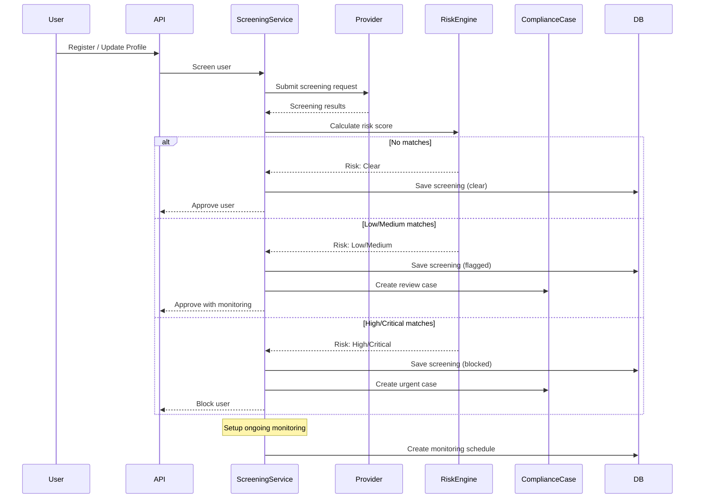

# Sanctions Screening Module

## Overview

The Sanctions Screening module provides real-time screening of users and transactions against global sanctions lists, PEP (Politically Exposed Persons) databases, and adverse media sources to ensure regulatory compliance and prevent financial crimes.

## Purpose

- Screen users against global sanctions lists (OFAC, UN, EU, etc.)
- Identify Politically Exposed Persons (PEPs)
- Monitor adverse media mentions
- Ongoing monitoring for existing users
- Risk scoring and automated decision-making
- Compliance reporting and audit trails

## Key Entities

### Screening Request
```typescript
class ScreeningRequest {
  id: string;
  entityType: EntityType;         // individual, organization
  entityId: string;               // User ID or Organization ID
  screeningType: ScreeningType;   // onboarding, transaction, periodic, manual

  // Entity details
  name: string;
  dateOfBirth?: Date;
  nationality?: string;
  countryOfResidence?: string;
  identificationNumbers?: string[];

  // Screening results
  status: ScreeningStatus;        // pending, completed, failed
  riskLevel: RiskLevel;           // clear, low, medium, high, critical
  overallScore: number;           // 0-100

  // Matches
  sanctionsMatches: SanctionMatch[];
  pepMatches: PepMatch[];
  adverseMediaMatches: AdverseMediaMatch[];

  // Metadata
  provider: string;               // complyadv, dow_jones, chainalysis
  completedAt?: Date;
  processingDuration?: number;

  createdAt: Date;
  updatedAt: Date;
}
```

### Sanction Match
```typescript
class SanctionMatch {
  id: string;
  screeningRequestId: string;

  // Match details
  listName: string;               // OFAC SDN, UN, EU, etc.
  listType: ListType;             // sanctions, pep, adverse_media
  matchScore: number;             // 0-100 (confidence)
  matchStrength: MatchStrength;   // weak, possible, strong, exact

  // Entity information
  entityName: string;
  aliases: string[];
  dateOfBirth?: Date;
  nationality?: string;
  addresses?: string[];

  // Sanctions details
  programs: string[];             // e.g., ['Counter Terrorism', 'Drug Trafficking']
  sanctionsType: string;
  addedDate: Date;
  source: string;

  // Decision
  decision: MatchDecision;        // false_positive, true_positive, under_review
  decidedBy?: string;
  decidedAt?: Date;
  notes?: string;

  createdAt: Date;
  updatedAt: Date;
}
```

### Ongoing Monitoring
```typescript
class OngoingMonitoring {
  id: string;
  userId: string;
  enabled: boolean;
  frequency: MonitoringFrequency; // daily, weekly, monthly

  // Last screening
  lastScreenedAt: Date;
  lastScreeningId: string;
  lastRiskLevel: RiskLevel;

  // Next screening
  nextScheduledAt: Date;

  // Changes detection
  hasChanges: boolean;
  changesDetectedAt?: Date;
  changesSummary?: string;

  createdAt: Date;
  updatedAt: Date;
}
```

## Sanctions Lists Covered

### Global Lists
- **OFAC SDN (Specially Designated Nationals)** - US Treasury
- **OFAC Non-SDN** - Consolidated list
- **UN Security Council Sanctions** - United Nations
- **EU Consolidated Sanctions** - European Union
- **UK HM Treasury Sanctions** - UK Government
- **DFAT Sanctions** - Australian Government

### PEP Lists
- **Global PEP Database** - Politically Exposed Persons
- **RCAs (Relatives and Close Associates)** - Family members
- **State-Owned Enterprises** - SOE executives

### Adverse Media
- **Financial Crime** - Money laundering, fraud, etc.
- **Terrorism** - Terrorist financing, support
- **Corruption** - Bribery, embezzlement
- **Drug Trafficking** - Narcotics-related crimes
- **Human Trafficking** - Modern slavery

## Screening Flow



## Risk Scoring Algorithm

```typescript
const calculateRiskScore = (screening: ScreeningRequest): number => {
  let score = 0;

  // Sanctions matches (0-50 points)
  for (const match of screening.sanctionsMatches) {
    if (match.matchStrength === 'exact') score += 50;
    else if (match.matchStrength === 'strong') score += 40;
    else if (match.matchStrength === 'possible') score += 20;
    else score += 5;

    // Critical lists add extra points
    if (match.listName.includes('OFAC') || match.listName.includes('UN')) {
      score += 10;
    }
  }

  // PEP matches (0-30 points)
  for (const match of screening.pepMatches) {
    if (match.pepLevel === 'direct') score += 30;
    else if (match.pepLevel === 'rca') score += 15;
    else score += 5;
  }

  // Adverse media (0-20 points)
  for (const match of screening.adverseMediaMatches) {
    if (match.severity === 'high') score += 20;
    else if (match.severity === 'medium') score += 10;
    else score += 5;
  }

  // Cap at 100
  return Math.min(100, score);
};

// Risk level determination
const determineRiskLevel = (score: number): RiskLevel => {
  if (score >= 80) return RiskLevel.CRITICAL;
  if (score >= 60) return RiskLevel.HIGH;
  if (score >= 30) return RiskLevel.MEDIUM;
  if (score >= 10) return RiskLevel.LOW;
  return RiskLevel.CLEAR;
};
```

## API Endpoints

### Screen User
```http
POST /sanctions/screen
Authorization: Bearer {adminToken}
Content-Type: application/json

{
  "entityType": "individual",
  "entityId": "user-123",
  "name": "John Doe",
  "dateOfBirth": "1985-05-15",
  "nationality": "CI",
  "countryOfResidence": "CI"
}
```

**Response:**
```json
{
  "id": "screening-456",
  "entityId": "user-123",
  "status": "completed",
  "riskLevel": "low",
  "overallScore": 15,
  "sanctionsMatches": [
    {
      "id": "match-789",
      "listName": "OFAC SDN",
      "matchScore": 45,
      "matchStrength": "possible",
      "entityName": "John R. Doe",
      "decision": "under_review"
    }
  ],
  "pepMatches": [],
  "adverseMediaMatches": [],
  "completedAt": "2026-01-29T12:00:05.000Z"
}
```

---

### Get Screening Results
```http
GET /sanctions/screening/{screeningId}
Authorization: Bearer {adminToken}
```

**Response:**
```json
{
  "id": "screening-456",
  "entityType": "individual",
  "entityId": "user-123",
  "screeningType": "onboarding",
  "status": "completed",
  "riskLevel": "medium",
  "overallScore": 45,
  "sanctionsMatches": [
    {
      "id": "match-789",
      "listName": "EU Sanctions",
      "matchScore": 75,
      "matchStrength": "strong",
      "entityName": "Jonathan Doe",
      "aliases": ["John Doe", "J. Doe"],
      "programs": ["Counter Terrorism"],
      "addedDate": "2020-03-15",
      "decision": "under_review"
    }
  ],
  "pepMatches": [],
  "adverseMediaMatches": [
    {
      "id": "media-101",
      "title": "Business owner linked to fraud investigation",
      "source": "Reuters",
      "date": "2024-08-20",
      "severity": "medium",
      "categories": ["financial_crime"]
    }
  ]
}
```

---

### Review Match Decision
```http
PUT /sanctions/matches/{matchId}
Authorization: Bearer {adminToken}
Content-Type: application/json

{
  "decision": "false_positive",
  "notes": "Different person - DOB doesn't match, nationality different"
}
```

**Response:**
```json
{
  "id": "match-789",
  "decision": "false_positive",
  "decidedBy": "admin-123",
  "decidedAt": "2026-01-29T12:30:00.000Z",
  "notes": "Different person - DOB doesn't match, nationality different"
}
```

---

### Get User Screening History
```http
GET /sanctions/users/{userId}/screenings
Authorization: Bearer {adminToken}
```

**Response:**
```json
{
  "data": [
    {
      "id": "screening-456",
      "screeningType": "onboarding",
      "riskLevel": "low",
      "overallScore": 15,
      "completedAt": "2026-01-15T10:00:00.000Z"
    },
    {
      "id": "screening-789",
      "screeningType": "periodic",
      "riskLevel": "low",
      "overallScore": 12,
      "completedAt": "2026-01-29T10:00:00.000Z"
    }
  ],
  "pagination": {
    "total": 2,
    "limit": 20,
    "offset": 0
  }
}
```

---

### Setup Ongoing Monitoring
```http
POST /sanctions/monitoring
Authorization: Bearer {adminToken}
Content-Type: application/json

{
  "userId": "user-123",
  "enabled": true,
  "frequency": "monthly"
}
```

**Response:**
```json
{
  "id": "monitor-456",
  "userId": "user-123",
  "enabled": true,
  "frequency": "monthly",
  "nextScheduledAt": "2026-02-28T10:00:00.000Z"
}
```

---

### Bulk Screen Users
```http
POST /sanctions/bulk-screen
Authorization: Bearer {adminToken}
Content-Type: application/json

{
  "userIds": ["user-1", "user-2", "user-3"],
  "screeningType": "periodic"
}
```

**Response:**
```json
{
  "success": true,
  "totalUsers": 3,
  "screeningsQueued": 3,
  "estimatedCompletionTime": "2026-01-29T12:30:00.000Z"
}
```

---

## Screening Triggers

### Onboarding Screening
```typescript
@OnEvent('user.registered')
async handleUserRegistered(event: UserRegisteredEvent) {
  await this.sanctionsScreeningService.screenUser({
    entityId: event.userId,
    screeningType: 'onboarding',
    name: event.name,
    dateOfBirth: event.dateOfBirth,
    nationality: event.nationality,
  });
}
```

### KYC Update Screening
```typescript
@OnEvent('kyc.submitted')
async handleKycSubmitted(event: KycSubmittedEvent) {
  await this.sanctionsScreeningService.screenUser({
    entityId: event.userId,
    screeningType: 'kyc_update',
    name: `${event.firstName} ${event.lastName}`,
    dateOfBirth: event.dateOfBirth,
    nationality: event.nationality,
    countryOfResidence: event.country,
    identificationNumbers: [event.idNumber],
  });
}
```

### Transaction Screening
```typescript
@OnEvent('transfer.created')
async handleTransferCreated(event: TransferCreatedEvent) {
  // Screen high-value transactions
  if (event.amount >= 10000) {
    await this.sanctionsScreeningService.screenTransaction({
      transferId: event.transferId,
      userId: event.userId,
      amount: event.amount,
    });
  }
}
```

### Periodic Screening (Cron)
```typescript
@Cron('0 0 * * *') // Daily at midnight
async runPeriodicScreening() {
  const usersToScreen = await this.ongoingMonitoringRepository
    .findDueForScreening();

  for (const user of usersToScreen) {
    await this.sanctionsScreeningService.screenUser({
      entityId: user.userId,
      screeningType: 'periodic',
    });
  }
}
```

---

## Automated Actions Based on Risk

```typescript
const handleScreeningResult = async (
  screening: ScreeningRequest
): Promise<void> => {
  switch (screening.riskLevel) {
    case RiskLevel.CLEAR:
    case RiskLevel.LOW:
      // No action needed
      await logScreening(screening);
      break;

    case RiskLevel.MEDIUM:
      // Create compliance case for review
      await createComplianceCase({
        userId: screening.entityId,
        type: 'sanctions_screening',
        severity: 'medium',
        description: `Medium risk screening result (score: ${screening.overallScore})`,
      });
      break;

    case RiskLevel.HIGH:
      // Create urgent case and flag account
      await createComplianceCase({
        userId: screening.entityId,
        type: 'sanctions_screening',
        severity: 'high',
        description: `High risk screening result (score: ${screening.overallScore})`,
      });
      await flagUserAccount(screening.entityId);
      break;

    case RiskLevel.CRITICAL:
      // Block account immediately and escalate
      await blockUserAccount(screening.entityId);
      await createComplianceCase({
        userId: screening.entityId,
        type: 'sanctions_screening',
        severity: 'critical',
        description: `Critical risk - possible sanctions match (score: ${screening.overallScore})`,
      });
      await alertComplianceTeam({
        severity: 'critical',
        userId: screening.entityId,
        screeningId: screening.id,
      });
      break;
  }
};
```

---

## Integration with Providers

### ComplyAdvantage
```typescript
@Injectable()
export class ComplyAdvantageAdapter {
  async screenIndividual(request: ScreeningRequest): Promise<ScreeningResult> {
    const response = await this.httpClient.post('/searches', {
      search_term: request.name,
      fuzziness: 0.6,
      filters: {
        types: ['sanction', 'warning', 'fitness-probity'],
        birth_year: request.dateOfBirth?.getFullYear(),
      },
    });

    return this.mapToScreeningResult(response.data);
  }
}
```

### Dow Jones (Factiva)
```typescript
@Injectable()
export class DowJonesAdapter {
  async screenIndividual(request: ScreeningRequest): Promise<ScreeningResult> {
    const response = await this.httpClient.post('/screening/v1/individuals', {
      name: request.name,
      dateOfBirth: request.dateOfBirth,
      nationality: request.nationality,
      checkTypes: ['SANCTIONS', 'PEP', 'ADVERSE_MEDIA'],
    });

    return this.mapToScreeningResult(response.data);
  }
}
```

---

## Dependencies

### Internal Modules
- **User Module:** User profile data
- **Compliance Module:** Case management
- **KYC Module:** Identity information
- **Notification Module:** Alert notifications

### External Services
- **ComplyAdvantage:** Sanctions & PEP screening
- **Dow Jones (Factiva):** Adverse media
- **Chainalysis:** Blockchain address screening (future)

---

## Configuration

```env
# Screening Provider
SANCTIONS_PROVIDER=complyadv
COMPLYADV_API_KEY=your-api-key
COMPLYADV_API_URL=https://api.complyadv.com

# Screening Settings
SANCTIONS_ENABLED=true
SANCTIONS_AUTO_SCREEN_ONBOARDING=true
SANCTIONS_AUTO_SCREEN_KYC=true
SANCTIONS_HIGH_VALUE_THRESHOLD=10000

# Risk Thresholds
SANCTIONS_CLEAR_THRESHOLD=10
SANCTIONS_LOW_THRESHOLD=30
SANCTIONS_MEDIUM_THRESHOLD=60
SANCTIONS_HIGH_THRESHOLD=80

# Ongoing Monitoring
ONGOING_MONITORING_ENABLED=true
ONGOING_MONITORING_DEFAULT_FREQUENCY=monthly
ONGOING_MONITORING_HIGH_RISK_FREQUENCY=weekly

# Auto Actions
AUTO_BLOCK_ON_CRITICAL=true
AUTO_FLAG_ON_HIGH=true
AUTO_CREATE_CASE_ON_MEDIUM=true
```

---

## Security & Compliance

### Data Privacy
- Screening data encrypted at rest
- Access logs for all screening requests
- Retention policy: 7 years (regulatory requirement)

### Audit Trail
```typescript
interface ScreeningAuditLog {
  timestamp: Date;
  userId: string;
  action: 'screen' | 'review' | 'approve' | 'block';
  actor: string;
  details: Record<string, any>;
}
```

### Regulatory Reporting
- Monthly screening statistics
- Blocked users report
- False positive analysis
- Provider performance metrics

---

## Monitoring & Alerts

### Metrics
- Screenings per day
- Average screening duration
- Risk level distribution
- False positive rate
- Provider API uptime

### Alerts
- **Critical match:** Immediate alert
- **Provider downtime:** > 5 minutes
- **High false positive rate:** > 20%
- **Screening failures:** > 5% failure rate
- **Long processing time:** > 30 seconds

---

## Future Enhancements

1. **Blockchain Screening:** Screen crypto addresses (Chainalysis)
2. **AI-Powered Matching:** Improve match accuracy
3. **Real-Time Monitoring:** Instant alerts on list updates
4. **Enhanced PEP Screening:** Include beneficial owners
5. **Media Sentiment Analysis:** AI-powered adverse media scoring
6. **Multi-Provider Redundancy:** Use multiple screening providers
7. **Custom Watchlists:** Internal watchlist management
8. **Screening Dashboard:** Real-time monitoring UI
9. **API Rate Optimization:** Batch screening for efficiency
10. **Historical Trending:** Track risk score changes over time

---

## Related Documentation

- [Compliance Module](./COMPLIANCE.md)
- [KYC Module](./COMPLIANCE.md#kyc-tiers)
- [User Module](./AUTH.md)
- [Architecture Overview](../ARCHITECTURE.md)
