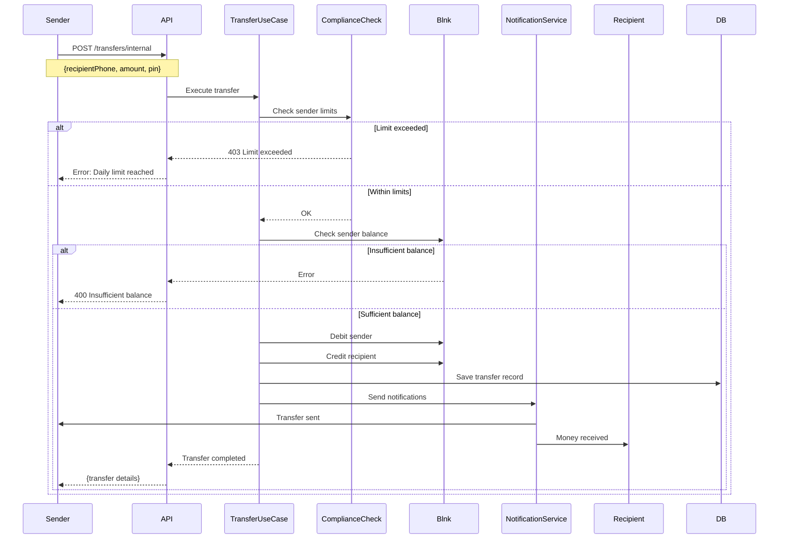
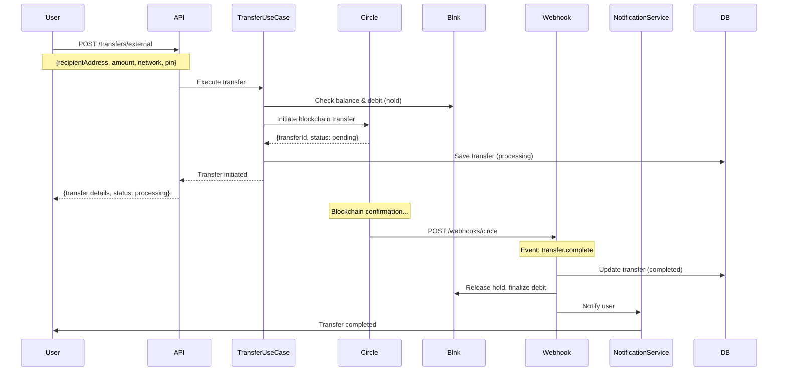

# Transfer Module

## Overview

The Transfer module handles peer-to-peer (P2P) internal transfers between JoonaPay users and external transfers to blockchain addresses. It provides comprehensive transfer tracking, history, and status management.

## Purpose

- Enable instant P2P transfers between users
- Support external USDC transfers to blockchain addresses
- Maintain complete transfer history
- Track transfer status and lifecycle
- Ensure idempotent and secure operations

## Key Entities

### Transfer (Domain Entity)
```typescript
class Transfer {
  id: string;
  reference: string;              // Human-readable reference (INT-ABC123)
  type: TransferType;             // internal, external
  status: TransferStatus;         // pending, processing, completed, failed

  // Sender info
  senderId: string;
  senderWalletId: string;

  // Recipient info (internal)
  recipientId?: string;
  recipientWalletId?: string;
  recipientPhone?: string;

  // Recipient info (external)
  recipientAddress?: string;
  recipientBlockchain?: string;

  // Financial details
  amount: number;                 // In cents
  fee: number;                    // In cents
  totalAmount: number;            // amount + fee
  currency: string;

  // Metadata
  note?: string;
  metadata?: Record<string, any>;

  // Timestamps
  createdAt: Date;
  updatedAt: Date;
  completedAt?: Date;
  failedAt?: Date;

  // Relationships
  transactions: Transaction[];
}
```

### TransferType
```typescript
enum TransferType {
  INTERNAL = 'internal',  // User to user (P2P)
  EXTERNAL = 'external',  // User to blockchain address
}
```

### TransferStatus
```typescript
enum TransferStatus {
  PENDING = 'pending',          // Initiated, not yet processed
  PROCESSING = 'processing',    // Being processed
  COMPLETED = 'completed',      // Successfully completed
  FAILED = 'failed',            // Failed
  CANCELLED = 'cancelled',      // Cancelled by user/system
}
```

## Transfer Flows

### Internal Transfer (P2P)



### External Transfer (Blockchain)



## API Endpoints

### Create Internal Transfer

```http
POST /transfers/internal
Authorization: Bearer {accessToken}
X-Pin-Token: {pinToken}
X-Idempotency-Key: 550e8400-e29b-41d4-a716-446655440000
Content-Type: application/json

{
  "recipientPhone": "+2250701234567",
  "amount": 5000,
  "currency": "USDC",
  "note": "Payment for lunch"
}
```

**Response:**
```json
{
  "id": "123e4567-e89b-12d3-a456-426614174000",
  "reference": "INT-ABC123XYZ",
  "type": "internal",
  "status": "completed",
  "senderId": "sender-user-id",
  "senderWalletId": "sender-wallet-id",
  "recipientId": "recipient-user-id",
  "recipientWalletId": "recipient-wallet-id",
  "recipientPhone": "+2250701234567",
  "amount": 5000,
  "fee": 0,
  "totalAmount": 5000,
  "currency": "USDC",
  "note": "Payment for lunch",
  "createdAt": "2026-01-29T12:00:00.000Z",
  "updatedAt": "2026-01-29T12:00:00.000Z",
  "completedAt": "2026-01-29T12:00:01.000Z"
}
```

**Rate Limit:** 10 requests per minute
**Security:** PIN verification required (X-Pin-Token header)
**Idempotency:** Supports idempotency keys to prevent duplicates

**Errors:**
- `400 PIN_REQUIRED`: Missing PIN token
- `400 INSUFFICIENT_BALANCE`: Not enough funds
- `403 LIMIT_EXCEEDED`: Daily/monthly limit reached
- `404 RECIPIENT_NOT_FOUND`: Recipient phone not registered
- `423 PIN_LOCKED`: Too many failed PIN attempts

---

### Create External Transfer

```http
POST /transfers/external
Authorization: Bearer {accessToken}
X-Pin-Token: {pinToken}
X-Idempotency-Key: 550e8400-e29b-41d4-a716-446655440000
Content-Type: application/json

{
  "recipientAddress": "0x742d35Cc6634C0532925a3b844Bc9e7595f0bEb0",
  "amount": 5000,
  "currency": "USDC",
  "network": "polygon",
  "note": "Withdrawal to personal wallet"
}
```

**Response:**
```json
{
  "id": "123e4567-e89b-12d3-a456-426614174000",
  "reference": "EXT-XYZ789ABC",
  "type": "external",
  "status": "processing",
  "senderId": "sender-user-id",
  "senderWalletId": "sender-wallet-id",
  "recipientAddress": "0x742d35Cc6634C0532925a3b844Bc9e7595f0bEb0",
  "recipientBlockchain": "polygon",
  "amount": 5000,
  "fee": 100,
  "totalAmount": 5100,
  "currency": "USDC",
  "note": "Withdrawal to personal wallet",
  "createdAt": "2026-01-29T12:00:00.000Z",
  "updatedAt": "2026-01-29T12:00:00.000Z"
}
```

**Rate Limit:** 5 requests per minute (stricter than internal)
**Supported Networks:** polygon, ethereum, arbitrum, base
**Estimated Completion:** 5-30 minutes depending on network

**Errors:**
- `400 INVALID_ADDRESS`: Blockchain address is invalid
- `400 INVALID_NETWORK`: Unsupported network
- `400 AMOUNT_TOO_LOW`: Below minimum (e.g., $1)
- `502 PROVIDER_ERROR`: Circle API error

---

### Get Transfer History

```http
GET /transfers?limit=20&offset=0
Authorization: Bearer {accessToken}
```

**Response:**
```json
{
  "data": [
    {
      "id": "...",
      "reference": "INT-ABC123",
      "type": "internal",
      "status": "completed",
      "amount": 5000,
      "fee": 0,
      "totalAmount": 5000,
      "currency": "USDC",
      "recipientPhone": "+2250701234567",
      "createdAt": "2026-01-29T12:00:00.000Z",
      "completedAt": "2026-01-29T12:00:01.000Z"
    }
  ],
  "pagination": {
    "total": 45,
    "limit": 20,
    "offset": 0,
    "hasMore": true
  }
}
```

**Query Parameters:**
- `limit`: Number of records (default: 20, max: 100)
- `offset`: Pagination offset (default: 0)
- `type`: Filter by type (internal, external)
- `status`: Filter by status (pending, completed, failed)

---

### Get Transfer by ID

```http
GET /transfers/{id}
Authorization: Bearer {accessToken}
```

**Response:**
```json
{
  "id": "123e4567-e89b-12d3-a456-426614174000",
  "reference": "INT-ABC123XYZ",
  "type": "internal",
  "status": "completed",
  "senderId": "sender-user-id",
  "senderWalletId": "sender-wallet-id",
  "recipientId": "recipient-user-id",
  "recipientWalletId": "recipient-wallet-id",
  "recipientPhone": "+2250701234567",
  "amount": 5000,
  "fee": 0,
  "totalAmount": 5000,
  "currency": "USDC",
  "note": "Payment for lunch",
  "createdAt": "2026-01-29T12:00:00.000Z",
  "updatedAt": "2026-01-29T12:00:00.000Z",
  "completedAt": "2026-01-29T12:00:01.000Z",
  "transactions": [
    {
      "id": "txn-1",
      "type": "debit",
      "amount": 5000,
      "balanceAfter": 95000
    },
    {
      "id": "txn-2",
      "type": "credit",
      "amount": 5000,
      "balanceAfter": 5000
    }
  ]
}
```

**Access Control:** User must be sender or recipient

**Errors:**
- `404 TRANSFER_NOT_FOUND`: Transfer doesn't exist
- `403 ACCESS_DENIED`: User is not sender or recipient

---

## Events Emitted

### transfer.created
Emitted when transfer is initiated.

```typescript
{
  transferId: string;
  type: TransferType;
  senderId: string;
  amount: number;
  currency: string;
  timestamp: Date;
}
```

---

### transfer.completed
Emitted when transfer is successfully completed.

```typescript
{
  transferId: string;
  type: TransferType;
  senderId: string;
  recipientId?: string;
  recipientAddress?: string;
  amount: number;
  fee: number;
  currency: string;
  timestamp: Date;
}
```

**Listeners:**
- Send push notification to sender
- Send push notification to recipient (internal only)
- Update analytics
- Update velocity rules

---

### transfer.failed
Emitted when transfer fails.

```typescript
{
  transferId: string;
  senderId: string;
  amount: number;
  reason: string;
  errorCode: string;
  timestamp: Date;
}
```

**Listeners:**
- Send notification to sender
- Log error for monitoring
- Refund sender if necessary

---

## Fee Structure

### Internal Transfers (P2P)
```typescript
const internalFee = 0; // Free
```

### External Transfers (Blockchain)
```typescript
const calculateExternalFee = (amount: number): number => {
  const feePercent = 0.01; // 1%
  const calculatedFee = amount * feePercent;

  // Min fee: $0.25, Max fee: $5.00
  return Math.max(25, Math.min(500, calculatedFee));
};
```

**Examples:**
- Transfer $10 → Fee: $0.25 (min fee)
- Transfer $50 → Fee: $0.50 (1%)
- Transfer $500 → Fee: $5.00 (max fee)
- Transfer $1000 → Fee: $5.00 (capped)

---

## Transfer Limits

### Internal Transfers
```typescript
const internalLimits = {
  tier_0: {
    singleTransaction: 10000,      // $100
    dailyLimit: 50000,             // $500
    monthlyLimit: 200000,          // $2,000
  },
  tier_1: {
    singleTransaction: 100000,     // $1,000
    dailyLimit: 500000,            // $5,000
    monthlyLimit: 2000000,         // $20,000
  },
  tier_2: {
    singleTransaction: 1000000,    // $10,000
    dailyLimit: 5000000,           // $50,000
    monthlyLimit: 20000000,        // $200,000
  },
};
```

### External Transfers
```typescript
const externalLimits = {
  tier_1: {
    singleTransaction: 50000,      // $500
    dailyLimit: 100000,            // $1,000
    monthlyLimit: 500000,          // $5,000
  },
  tier_2: {
    singleTransaction: 500000,     // $5,000
    dailyLimit: 1000000,           // $10,000
    monthlyLimit: 5000000,         // $50,000
  },
};
```

**Note:** Tier 0 (unverified) users cannot make external transfers.

---

## Security Considerations

### PIN Verification
```typescript
// All transfers require PIN verification
const pinToken = await verifyPIN(userId, pin);

// Include token in transfer request
headers: {
  'X-Pin-Token': pinToken,
}
```

### Idempotency
```typescript
// Generate idempotency key on client
const idempotencyKey = uuidv4();

// Include in header
headers: {
  'X-Idempotency-Key': idempotencyKey,
}

// Server checks if transfer with this key exists
const existing = await findByIdempotencyKey(idempotencyKey);
if (existing) {
  return existing; // Return original response
}
```

### Address Validation
```typescript
const validateAddress = (address: string, network: string): boolean => {
  // EVM networks (Ethereum, Polygon, Arbitrum)
  if (['ethereum', 'polygon', 'arbitrum'].includes(network)) {
    return /^0x[a-fA-F0-9]{40}$/.test(address);
  }

  // Add other network validations
  return false;
};
```

### Balance Atomicity
```typescript
// Use database transactions to ensure atomicity
await db.transaction(async (trx) => {
  // 1. Lock sender wallet
  const senderWallet = await Wallet.findById(senderId).forUpdate();

  // 2. Check balance
  if (senderWallet.balance < totalAmount) {
    throw new InsufficientBalanceException();
  }

  // 3. Debit sender
  await senderWallet.debit(totalAmount);

  // 4. Credit recipient (internal only)
  if (type === 'internal') {
    const recipientWallet = await Wallet.findById(recipientId).forUpdate();
    await recipientWallet.credit(amount);
  }

  // 5. Create transfer record
  await Transfer.create({...});
});
```

---

## Dependencies

### Internal Modules
- **Wallet Module:** Balance checks and updates
- **Compliance Module:** Limit enforcement, AML checks
- **Notification Module:** Transfer notifications
- **User Module:** Recipient lookup by phone

### External Services
- **Blnk:** Ledger for internal transfers
- **Circle:** Blockchain transfers
- **Redis:** Idempotency key storage

---

## Configuration

```env
# Transfer Fees
INTERNAL_TRANSFER_FEE=0
EXTERNAL_TRANSFER_FEE_PERCENT=1
EXTERNAL_TRANSFER_MIN_FEE=25      # $0.25 in cents
EXTERNAL_TRANSFER_MAX_FEE=500     # $5.00 in cents

# Transfer Limits (Tier 0 - Unverified)
TIER_0_SINGLE_TX_LIMIT=10000      # $100
TIER_0_DAILY_LIMIT=50000          # $500
TIER_0_MONTHLY_LIMIT=200000       # $2,000

# Transfer Limits (Tier 1 - Basic KYC)
TIER_1_SINGLE_TX_LIMIT=100000     # $1,000
TIER_1_DAILY_LIMIT=500000         # $5,000
TIER_1_MONTHLY_LIMIT=2000000      # $20,000

# Transfer Limits (Tier 2 - Full KYC)
TIER_2_SINGLE_TX_LIMIT=1000000    # $10,000
TIER_2_DAILY_LIMIT=5000000        # $50,000
TIER_2_MONTHLY_LIMIT=20000000     # $200,000

# External Transfer Settings
EXTERNAL_MIN_AMOUNT=100           # $1.00 minimum
EXTERNAL_NETWORKS=polygon,ethereum,arbitrum,base

# Idempotency
IDEMPOTENCY_KEY_TTL=86400         # 24 hours
```

---

## Error Codes

| Code | HTTP | Description | Recovery |
|------|------|-------------|----------|
| `TRANSFER_NOT_FOUND` | 404 | Transfer does not exist | Check transfer ID |
| `RECIPIENT_NOT_FOUND` | 404 | Recipient phone not registered | Verify phone number |
| `INSUFFICIENT_BALANCE` | 400 | Not enough funds | Add funds to wallet |
| `LIMIT_EXCEEDED` | 403 | Daily/monthly limit reached | Wait or upgrade KYC |
| `INVALID_AMOUNT` | 400 | Amount invalid or zero | Check amount |
| `AMOUNT_TOO_LOW` | 400 | Below minimum | Increase amount |
| `AMOUNT_TOO_HIGH` | 400 | Above maximum | Split transfer |
| `INVALID_ADDRESS` | 400 | Blockchain address invalid | Verify address |
| `INVALID_NETWORK` | 400 | Unsupported network | Use supported network |
| `PIN_REQUIRED` | 400 | PIN verification required | Verify PIN first |
| `PIN_INVALID` | 401 | PIN is incorrect | Check PIN |
| `DUPLICATE_TRANSFER` | 409 | Idempotency key already used | Check existing transfer |
| `PROVIDER_ERROR` | 502 | External provider error | Retry later |

---

## Performance Considerations

### Database Indexes
```sql
CREATE INDEX idx_transfers_sender_id ON transfers(sender_id);
CREATE INDEX idx_transfers_recipient_id ON transfers(recipient_id);
CREATE INDEX idx_transfers_status ON transfers(status);
CREATE INDEX idx_transfers_created_at ON transfers(created_at DESC);
CREATE INDEX idx_transfers_reference ON transfers(reference);
CREATE INDEX idx_transfers_idempotency_key ON transfers(idempotency_key);
```

### Caching
```typescript
// Cache recent transfers for user
const cacheKey = `transfers:${userId}:recent`;
await redis.set(cacheKey, JSON.stringify(transfers), 'EX', 300);
```

### Pagination
```typescript
// Always paginate transfer history
const transfers = await transferRepository.findByUserId(
  userId,
  { limit: 20, offset: 0 }
);
```

---

## Monitoring & Alerts

### Metrics
- Transfer volume (count and amount)
- Internal vs external ratio
- Average transfer amount
- Transfer success rate
- Average processing time
- Failed transfer rate

### Alerts
- **High failure rate:** > 5% failed transfers
- **Processing delays:** > 1 minute for internal transfers
- **Large transfers:** > $10,000 in single transfer
- **Unusual volume:** > 100 transfers in 1 hour per user
- **Provider downtime:** Circle API errors

---

## Future Enhancements

1. **Scheduled Transfers:** Set up recurring transfers
2. **Transfer Templates:** Save frequent recipients
3. **Batch Transfers:** Send to multiple recipients
4. **QR Code Transfers:** Scan to send
5. **Transfer Requests:** Request money from users
6. **Split Transfers:** Split bills among friends
7. **Transfer Analytics:** Spending insights
8. **Transfer Categories:** Tag transfers (food, bills, etc.)
9. **Transfer Cancellation:** Cancel pending external transfers
10. **Multi-Currency:** Support XOF direct transfers

---

## Related Documentation

- [Wallet Module](./WALLET.md)
- [Compliance Module](./COMPLIANCE.md)
- [Notification Module](./NOTIFICATION.md)
- [Architecture Overview](../ARCHITECTURE.md)
