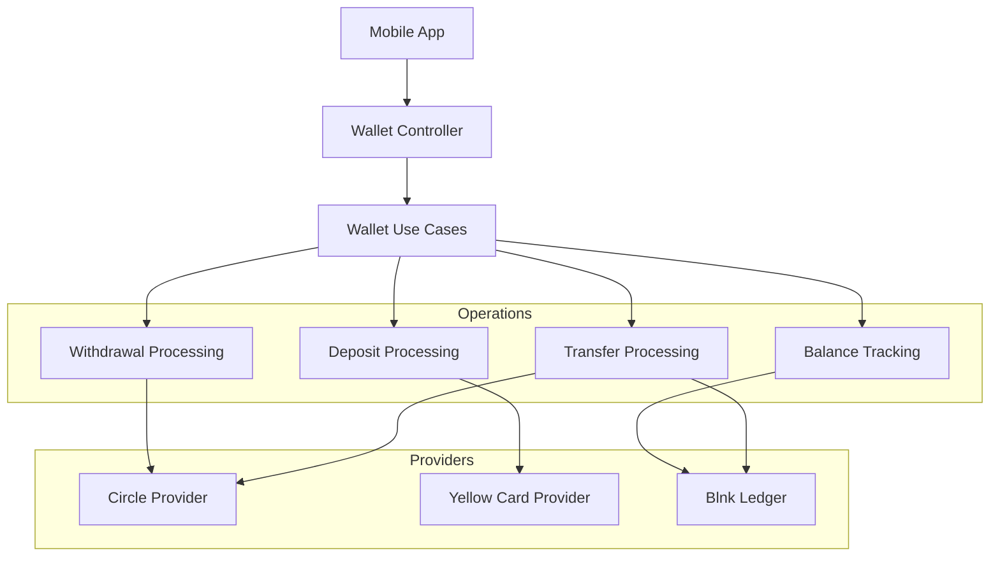
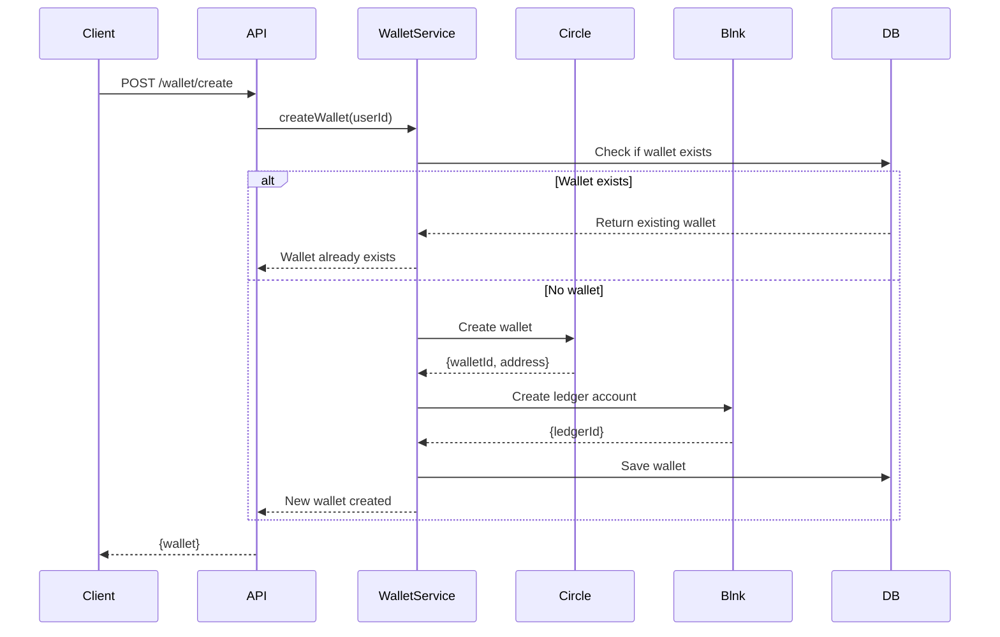
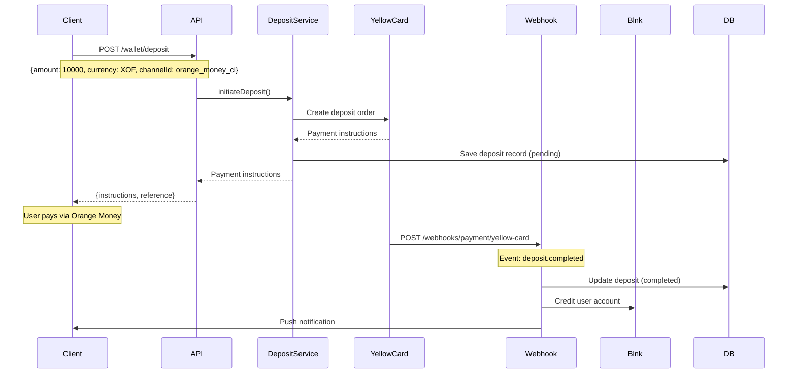
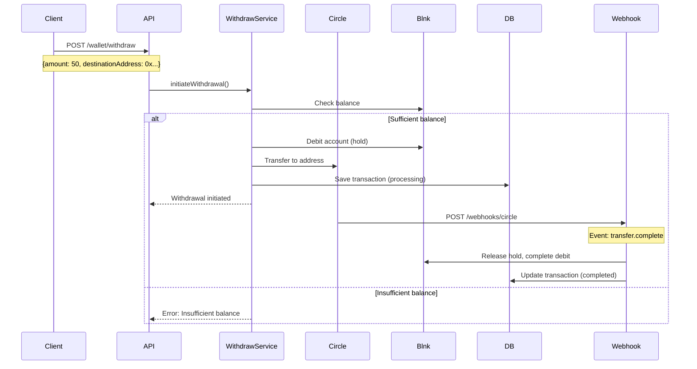

# Wallet Management Module

## Overview

The Wallet module is the core financial component of JoonaPay, handling wallet creation, balance management, deposits (on-ramp), withdrawals (off-ramp), and integration with blockchain providers (Circle) and mobile money providers (Yellow Card).

## Purpose

- Create and manage USDC wallets
- Track balances across multiple currencies
- Facilitate deposits from XOF to USDC
- Handle withdrawals from USDC to XOF or blockchain
- Integrate with Circle for blockchain operations
- Support multi-provider architecture

## Key Entities

### Wallet (Domain Entity)
```typescript
class Wallet {
  id: string;
  userId: string;
  circleWalletId: string;        // Circle wallet ID
  circleWalletAddress: string;   // Blockchain address
  currency: string;              // Primary: USDC
  balance: number;               // Current balance
  pendingBalance: number;        // Pending transactions
  status: WalletStatus;          // active, suspended, closed
  createdAt: Date;
  updatedAt: Date;

  debit(amount: number): void;
  credit(amount: number): void;
  freeze(): void;
  unfreeze(): void;
}
```

### Transaction (Domain Entity)
```typescript
class Transaction {
  id: string;
  walletId: string;
  type: TransactionType;         // credit, debit, fee
  amount: number;
  balanceAfter: number;
  reference: string;
  metadata: Record<string, any>;
  status: TransactionStatus;     // pending, completed, failed
  createdAt: Date;
}
```

### Deposit (Domain Entity)
```typescript
class Deposit {
  id: string;
  userId: string;
  walletId: string;
  provider: string;              // yellowcard, circle
  channelId: string;             // orange_money_ci, mtn_sn
  sourceAmount: number;          // e.g., 10000 XOF
  sourceCurrency: string;        // XOF
  targetAmount: number;          // e.g., 16.60 USD
  targetCurrency: string;        // USD
  exchangeRate: number;
  fee: number;
  status: DepositStatus;         // pending, processing, completed, failed
  paymentInstructions: PaymentInstructions;
  expiresAt: Date;
  completedAt?: Date;
}
```

## Multi-Provider Architecture



## Wallet Creation Flow



## Deposit Flow (XOF → USDC)



## Withdrawal Flow (USDC → XOF or Blockchain)



## API Endpoints

### Wallet Management

#### Get Balance
```http
GET /wallet
Authorization: Bearer {accessToken}
```

**Response:**
```json
{
  "walletId": "123e4567-e89b-12d3-a456-426614174000",
  "currency": "USD",
  "balances": [
    {
      "currency": "USD",
      "available": 100.00,
      "pending": 5.00,
      "total": 105.00
    }
  ]
}
```

---

#### Create Wallet
```http
POST /wallet/create
Authorization: Bearer {accessToken}
```

**Response:**
```json
{
  "id": "123e4567-e89b-12d3-a456-426614174000",
  "userId": "user-123",
  "circleWalletId": "55c56c99-63f9-5426-ab08-10d40d196a8f",
  "circleWalletAddress": "0x3ca7a6241ee8490dc847b3ee9635b4ecfe9f9bc5",
  "currency": "USDC",
  "balance": 0,
  "status": "active"
}
```

---

### Deposit (On-Ramp)

#### Get Deposit Channels
```http
GET /wallet/deposit/channels?currency=XOF
Authorization: Bearer {accessToken}
```

**Response:**
```json
{
  "channels": [
    {
      "id": "orange_money_ci",
      "name": "Orange Money",
      "type": "mobile_money",
      "provider": "orange",
      "country": "CI",
      "minAmount": 1000,
      "maxAmount": 500000,
      "fee": 1.5,
      "feeType": "percentage",
      "currency": "XOF"
    },
    {
      "id": "mtn_money_ci",
      "name": "MTN Mobile Money",
      "type": "mobile_money",
      "provider": "mtn",
      "country": "CI",
      "minAmount": 1000,
      "maxAmount": 500000,
      "fee": 1.5,
      "feeType": "percentage",
      "currency": "XOF"
    }
  ]
}
```

---

#### Initiate Deposit
```http
POST /wallet/deposit
Authorization: Bearer {accessToken}
X-Idempotency-Key: 550e8400-e29b-41d4-a716-446655440000
Content-Type: application/json

{
  "amount": 10000,
  "sourceCurrency": "XOF",
  "channelId": "orange_money_ci"
}
```

**Response:**
```json
{
  "transactionId": "123e4567-e89b-12d3-a456-426614174000",
  "depositId": "dep_1234567890",
  "amount": 10000,
  "sourceCurrency": "XOF",
  "targetCurrency": "USD",
  "rate": 0.00166,
  "fee": 150,
  "estimatedAmount": 16.45,
  "paymentInstructions": {
    "type": "mobile_money",
    "provider": "orange",
    "accountNumber": "+2250700000000",
    "reference": "DEP-ABC12345",
    "instructions": "Dial *144# and follow prompts to send 10,000 XOF to +2250700000000. Use reference: DEP-ABC12345"
  },
  "expiresAt": "2026-01-29T13:00:00.000Z"
}
```

**Idempotency:** Duplicate requests with same key return original response
**Expiry:** Payment instructions expire after 30 minutes

---

### Withdrawal (Off-Ramp)

#### Withdraw to Blockchain
```http
POST /wallet/withdraw
Authorization: Bearer {accessToken}
X-Pin-Token: {pinToken}
X-Idempotency-Key: 550e8400-e29b-41d4-a716-446655440000
Content-Type: application/json

{
  "amount": 50.00,
  "destinationAddress": "0x742d35Cc6634C0532925a3b844Bc9e7595f0bEb0",
  "network": "polygon"
}
```

**Response:**
```json
{
  "transactionId": "123e4567-e89b-12d3-a456-426614174000",
  "amount": 50.00,
  "destinationAddress": "0x742d35Cc6634C0532925a3b844Bc9e7595f0bEb0",
  "network": "polygon",
  "fee": 0.25,
  "status": "pending"
}
```

**Security:** Requires PIN verification (X-Pin-Token header)
**Networks Supported:** polygon, ethereum, arbitrum
**Fees:** Dynamic based on network congestion

---

### Exchange Rates

#### Get Exchange Rate
```http
GET /wallet/rate?sourceCurrency=XOF&targetCurrency=USD&amount=10000
Authorization: Bearer {accessToken}
```

**Response:**
```json
{
  "sourceCurrency": "XOF",
  "targetCurrency": "USD",
  "rate": 0.00166,
  "sourceAmount": 10000,
  "targetAmount": 16.60,
  "fee": 150,
  "expiresAt": "2026-01-29T12:05:00.000Z"
}
```

**Rate Validity:** 5 minutes
**Rate Source:** Live rates from Yellow Card API

---

### PIN Management

#### Verify PIN
```http
POST /wallet/pin/verify
Authorization: Bearer {accessToken}
Content-Type: application/json

{
  "pin": "1234"
}
```

**Response:**
```json
{
  "valid": true,
  "message": "PIN verified successfully",
  "pinToken": "eyJhbGciOiJIUzI1NiIs...",
  "expiresIn": 300
}
```

**Rate Limit:** 5 attempts per minute
**Lockout:** After 5 failed attempts, PIN locked for 30 minutes
**Token Validity:** 5 minutes

**Errors:**
```json
{
  "message": "Invalid PIN",
  "remainingAttempts": 3
}
```

---

#### Set/Update PIN
```http
POST /wallet/pin/set
Authorization: Bearer {accessToken}
Content-Type: application/json

{
  "pin": "1234",
  "confirmPin": "1234"
}
```

**Response:**
```json
{
  "success": true,
  "message": "PIN set successfully"
}
```

**Validation:**
- Length: exactly 4 or 6 digits
- No sequential numbers (1234, 4321)
- No repeated digits (1111)

---

### KYC (See also: Compliance Module)

#### Get KYC Status
```http
GET /wallet/kyc/status
Authorization: Bearer {accessToken}
```

**Response:**
```json
{
  "walletId": "123e4567-e89b-12d3-a456-426614174000",
  "kycStatus": "tier_2",
  "providerStatus": "verified",
  "verifiedAt": "2026-01-20T12:00:00.000Z"
}
```

---

#### Submit KYC
```http
POST /wallet/kyc/submit
Authorization: Bearer {accessToken}
Content-Type: application/json

{
  "firstName": "John",
  "lastName": "Doe",
  "dateOfBirth": "1990-01-15",
  "country": "CI",
  "idType": "national_id",
  "idNumber": "CI12345678",
  "idExpiryDate": "2030-01-15",
  "address": "123 Main St, Abidjan, Côte d'Ivoire",
  "documentFrontKey": "s3-key-front",
  "documentBackKey": "s3-key-back",
  "selfieKey": "s3-key-selfie"
}
```

**Response:**
```json
{
  "walletId": "123e4567-e89b-12d3-a456-426614174000",
  "kycStatus": "pending",
  "message": "KYC submitted successfully. Verification pending.",
  "submittedAt": "2026-01-29T12:00:00.000Z"
}
```

---

### Internal Transfers (P2P)

#### Transfer to User
```http
POST /wallet/transfer/internal
Authorization: Bearer {accessToken}
X-Pin-Token: {pinToken}
X-Idempotency-Key: 550e8400-e29b-41d4-a716-446655440000
Content-Type: application/json

{
  "toPhone": "+2250701234567",
  "amount": 50.00,
  "currency": "USD"
}
```

**Response:**
```json
{
  "transactionId": "123e4567-e89b-12d3-a456-426614174000",
  "fromWalletId": "wallet-1",
  "toWalletId": "wallet-2",
  "toPhone": "+2250701234567",
  "amount": 50,
  "currency": "USD",
  "fee": 0,
  "status": "completed"
}
```

**Fee:** Free for internal transfers
**Security:** PIN required
**Idempotency:** Prevents duplicate transfers

---

### External Transfers (Blockchain)

#### Transfer to External Address
```http
POST /wallet/transfer/external
Authorization: Bearer {accessToken}
X-Pin-Token: {pinToken}
X-Idempotency-Key: 550e8400-e29b-41d4-a716-446655440000
Content-Type: application/json

{
  "toAddress": "0x742d35Cc6634C0532925a3b844Bc9e7595f0bEb0",
  "amount": 50.00,
  "currency": "USD",
  "network": "polygon"
}
```

**Response:**
```json
{
  "transactionId": "123e4567-e89b-12d3-a456-426614174000",
  "walletId": "wallet-1",
  "toAddress": "0x742d35Cc6634C0532925a3b844Bc9e7595f0bEb0",
  "amount": 50,
  "currency": "USD",
  "fee": 0.25,
  "status": "pending",
  "estimatedArrival": "5-30 minutes"
}
```

## Events Emitted

### wallet.created
```typescript
{
  walletId: string;
  userId: string;
  circleWalletId: string;
  timestamp: Date;
}
```

---

### deposit.initiated
```typescript
{
  depositId: string;
  userId: string;
  amount: number;
  sourceCurrency: string;
  targetCurrency: string;
  timestamp: Date;
}
```

---

### deposit.completed
```typescript
{
  depositId: string;
  userId: string;
  walletId: string;
  amount: number;
  currency: string;
  timestamp: Date;
}
```

**Listeners:**
- Send notification
- Update balance cache
- Record analytics

---

### withdrawal.initiated
```typescript
{
  withdrawalId: string;
  userId: string;
  amount: number;
  destinationAddress: string;
  timestamp: Date;
}
```

---

### withdrawal.completed
```typescript
{
  withdrawalId: string;
  userId: string;
  amount: number;
  fee: number;
  txHash: string;
  timestamp: Date;
}
```

---

### balance.updated
```typescript
{
  walletId: string;
  userId: string;
  previousBalance: number;
  newBalance: number;
  reason: string;
  timestamp: Date;
}
```

## Dependencies

### Internal Modules
- **User Module:** User authentication and authorization
- **Compliance Module:** KYC verification, limits checking
- **Transfer Module:** P2P and external transfers
- **Notification Module:** Transaction notifications

### External Services
- **Circle:** Blockchain wallet creation, USDC transfers
- **Yellow Card:** Mobile money on-ramp/off-ramp
- **Blnk:** Double-entry ledger for transaction recording
- **Twilio:** SMS notifications (optional)

## Configuration

```env
# Circle Configuration
CIRCLE_API_KEY=your-circle-api-key
CIRCLE_ENTITY_SECRET=your-entity-secret
CIRCLE_WALLET_SET_ID=your-wallet-set-id

# Yellow Card Configuration
YELLOW_CARD_API_KEY=your-yc-api-key
YELLOW_CARD_SECRET_KEY=your-yc-secret
YELLOW_CARD_WEBHOOK_SECRET=your-webhook-secret

# Blnk Ledger
BLNK_API_URL=https://api.blnk.io
BLNK_API_KEY=your-blnk-key

# Fee Configuration
INTERNAL_TRANSFER_FEE=0
EXTERNAL_TRANSFER_FEE_PERCENT=1
EXTERNAL_TRANSFER_MIN_FEE=0.25
EXTERNAL_TRANSFER_MAX_FEE=5

# Deposit Configuration
DEPOSIT_MIN_AMOUNT_XOF=1000
DEPOSIT_MAX_AMOUNT_XOF=500000
DEPOSIT_FEE_PERCENT=1.5
DEPOSIT_EXPIRY_MINUTES=30

# PIN Configuration
PIN_HASH_ROUNDS=12
PIN_MAX_ATTEMPTS=5
PIN_LOCKOUT_DURATION=1800  # 30 minutes
PIN_TOKEN_EXPIRY=300       # 5 minutes
```

## Security Considerations

### PIN Security
1. **Hashing:** PINs hashed with bcrypt (12 rounds)
2. **Attempt Limiting:** Max 5 attempts before lockout
3. **Lockout:** 30-minute lockout after failed attempts
4. **Token-Based:** PIN verification returns short-lived token
5. **Validation:** No weak PINs (1234, 1111, etc.)

### Transaction Security
1. **Idempotency:** All financial operations support idempotency keys
2. **PIN Verification:** Required for withdrawals and transfers
3. **Rate Limiting:** Stricter limits on financial operations
4. **Balance Checks:** Verify sufficient balance before operations
5. **Atomic Operations:** Use database transactions for consistency

### Blockchain Security
1. **Address Validation:** Verify address format before transfer
2. **Network Validation:** Ensure correct network for address
3. **Amount Limits:** Enforce min/max transfer amounts
4. **Wallet Custody:** Circle handles private key management
5. **Transaction Monitoring:** Monitor for suspicious patterns

## Performance Considerations

### Balance Caching
```typescript
// Cache balance in Redis for 5 minutes
await redis.set(`balance:${walletId}`, balance, 'EX', 300);
```

### Database Indexes
```sql
CREATE INDEX idx_wallets_user_id ON wallets(user_id);
CREATE INDEX idx_transactions_wallet_id ON transactions(wallet_id);
CREATE INDEX idx_transactions_created_at ON transactions(created_at DESC);
CREATE INDEX idx_deposits_user_id_status ON deposits(user_id, status);
```

### Pagination
```typescript
// Always paginate transaction history
GET /transactions?limit=20&offset=0
```

## Error Codes

| Code | HTTP | Description |
|------|------|-------------|
| `WALLET_NOT_FOUND` | 404 | Wallet does not exist |
| `WALLET_ALREADY_EXISTS` | 409 | User already has wallet |
| `INSUFFICIENT_BALANCE` | 400 | Not enough funds |
| `INVALID_AMOUNT` | 400 | Amount is invalid or zero |
| `AMOUNT_TOO_LOW` | 400 | Below minimum amount |
| `AMOUNT_TOO_HIGH` | 400 | Exceeds maximum amount |
| `INVALID_ADDRESS` | 400 | Blockchain address invalid |
| `INVALID_NETWORK` | 400 | Unsupported network |
| `INVALID_PIN` | 401 | PIN is incorrect |
| `PIN_LOCKED` | 423 | PIN locked due to attempts |
| `PIN_NOT_SET` | 400 | User has not set PIN |
| `DEPOSIT_EXPIRED` | 400 | Deposit window expired |
| `CHANNEL_NOT_FOUND` | 404 | Payment channel not found |
| `RATE_EXPIRED` | 400 | Exchange rate expired |
| `PROVIDER_ERROR` | 502 | External provider error |

## Monitoring & Alerts

### Metrics
- Wallet creation rate
- Deposit success rate
- Withdrawal success rate
- Average deposit time
- Average withdrawal time
- Balance discrepancies
- Provider API latency

### Alerts
- **Deposit failures:** > 10% failure rate
- **Withdrawal failures:** > 5% failure rate
- **Balance mismatch:** Blnk vs DB balance differs
- **Provider downtime:** Circle or Yellow Card API errors
- **Large withdrawals:** > $10,000 in single transaction
- **Unusual activity:** > 10 deposits in 1 hour per user

## Future Enhancements

1. **Multi-Currency Support:** XOF balance alongside USDC
2. **Recurring Deposits:** Auto-deposit from mobile money
3. **Savings Goals:** Separate pots for savings
4. **Interest Earning:** Yield on USDC balances
5. **Stablecoin Swap:** Convert between USDC, USDT, DAI
6. **Fiat Off-Ramp:** Withdraw directly to bank account
7. **Card Integration:** Virtual/physical debit cards
8. **Direct Debits:** Authorize merchants to pull funds
9. **Payment Requests:** Request money from other users
10. **Wallet Analytics:** Spending insights and reports

## Related Documentation

- [Transfer Module](./TRANSFER.md)
- [Compliance Module](./COMPLIANCE.md)
- [Webhook Module](./WEBHOOK.md)
- [Notification Module](./NOTIFICATION.md)
