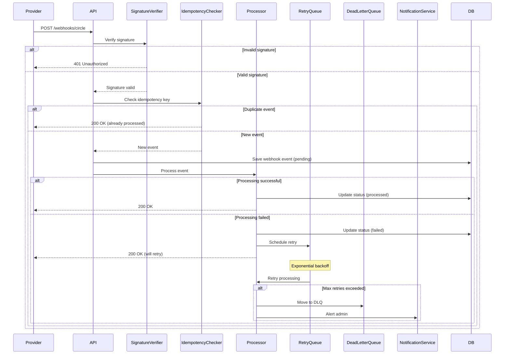

# Webhook Module

## Overview

The Webhook module handles incoming webhooks from external payment providers (Circle, Yellow Card, etc.), ensuring reliable processing through signature verification, idempotency, dead letter queues, and automatic retry with exponential backoff.

## Purpose

- Receive and process provider webhooks
- Verify webhook signatures for security
- Ensure idempotent processing (no duplicates)
- Handle failures with automatic retry
- Dead letter queue for unprocessable events
- Audit trail for all webhook events

## Key Entities

### Webhook Event (Domain Entity)
```typescript
class WebhookEvent {
  id: string;
  provider: WebhookProvider;       // circle, yellowcard, twilio
  eventType: string;               // deposit.completed, transfer.complete
  payload: Record<string, any>;
  signature: string;
  signatureValid: boolean;

  // Processing status
  status: WebhookStatus;           // pending, processing, processed, failed, dead_letter
  processedAt?: Date;
  failedAt?: Date;
  failureReason?: string;
  retryCount: number;

  // Idempotency
  idempotencyKey: string;          // Provider's event ID

  // Metadata
  receivedAt: Date;
  processedBy?: string;            // Worker ID
  processingDuration?: number;     // milliseconds

  createdAt: Date;
  updatedAt: Date;
}
```

### Webhook Retry
```typescript
class WebhookRetry {
  id: string;
  webhookEventId: string;
  attemptNumber: number;
  scheduledFor: Date;
  executedAt?: Date;
  succeeded: boolean;
  errorMessage?: string;
  createdAt: Date;
}
```

### WebhookProvider
```typescript
enum WebhookProvider {
  CIRCLE = 'circle',
  YELLOW_CARD = 'yellowcard',
  TWILIO = 'twilio',
}
```

### WebhookStatus
```typescript
enum WebhookStatus {
  PENDING = 'pending',           // Received, not yet processed
  PROCESSING = 'processing',     // Currently being processed
  PROCESSED = 'processed',       // Successfully processed
  FAILED = 'failed',             // Failed, will retry
  DEAD_LETTER = 'dead_letter',   // Max retries exceeded
}
```

## Webhook Processing Flow



## Webhook Providers

### Circle (Blockchain/USDC)

#### Event Types
```typescript
enum CircleEventType {
  TRANSFER_COMPLETE = 'transfer.complete',
  TRANSFER_FAILED = 'transfer.failed',
  WALLET_CREATED = 'wallet.created',
  PAYMENT_RECEIVED = 'payment.received',
}
```

#### Payload Example
```json
{
  "eventType": "transfer.complete",
  "eventId": "circle-event-123",
  "timestamp": "2026-01-29T12:00:00.000Z",
  "data": {
    "transferId": "55c56c99-63f9-5426-ab08-10d40d196a8f",
    "source": {
      "type": "wallet",
      "id": "wallet-source-123"
    },
    "destination": {
      "type": "blockchain",
      "address": "0x742d35Cc6634C0532925a3b844Bc9e7595f0bEb0",
      "chain": "MATIC"
    },
    "amount": {
      "amount": "50.00",
      "currency": "USD"
    },
    "status": "complete",
    "transactionHash": "0xabc123..."
  }
}
```

#### Signature Verification
```typescript
const verifyCircleSignature = (
  payload: string,
  signature: string,
  secret: string
): boolean => {
  const hmac = crypto.createHmac('sha256', secret);
  hmac.update(payload);
  const expectedSignature = hmac.digest('hex');
  return crypto.timingSafeEqual(
    Buffer.from(signature),
    Buffer.from(expectedSignature)
  );
};
```

---

### Yellow Card (Mobile Money)

#### Event Types
```typescript
enum YellowCardEventType {
  DEPOSIT_COMPLETED = 'deposit.completed',
  DEPOSIT_FAILED = 'deposit.failed',
  WITHDRAWAL_COMPLETED = 'withdrawal.completed',
  WITHDRAWAL_FAILED = 'withdrawal.failed',
}
```

#### Payload Example
```json
{
  "eventType": "deposit.completed",
  "eventId": "yc-event-456",
  "timestamp": "2026-01-29T12:00:00.000Z",
  "data": {
    "orderId": "order-789",
    "userId": "user-123",
    "sourceAmount": 10000,
    "sourceCurrency": "XOF",
    "targetAmount": 16.60,
    "targetCurrency": "USD",
    "exchangeRate": 0.00166,
    "fee": 150,
    "status": "completed",
    "paymentMethod": "orange_money",
    "reference": "DEP-ABC123"
  }
}
```

#### Signature Verification
```typescript
const verifyYellowCardSignature = (
  payload: string,
  signature: string,
  secret: string
): boolean => {
  const hmac = crypto.createHmac('sha256', secret);
  hmac.update(payload);
  const expectedSignature = hmac.digest('base64');
  return signature === expectedSignature;
};
```

---

### Twilio (SMS/OTP)

#### Event Types
```typescript
enum TwilioEventType {
  MESSAGE_DELIVERED = 'message.delivered',
  MESSAGE_FAILED = 'message.failed',
  MESSAGE_SENT = 'message.sent',
}
```

#### Payload Example
```json
{
  "MessageSid": "SM123456789",
  "MessageStatus": "delivered",
  "To": "+2250701234567",
  "From": "+1234567890",
  "Body": "Your OTP is 123456",
  "EventType": "message.delivered"
}
```

---

## API Endpoints

### Circle Webhook
```http
POST /webhooks/circle
X-Circle-Signature: signature-here
Content-Type: application/json

{
  "eventType": "transfer.complete",
  "eventId": "circle-event-123",
  "data": { /* ... */ }
}
```

**Response:**
```json
{
  "success": true,
  "eventType": "transfer.complete",
  "processed": true
}
```

**Errors:**
- `401`: Invalid signature
- `500`: Processing error (will retry)

---

### Yellow Card Webhook
```http
POST /webhooks/payment/yellow-card
X-YC-Signature: signature-here
Content-Type: application/json

{
  "eventType": "deposit.completed",
  "eventId": "yc-event-456",
  "data": { /* ... */ }
}
```

**Response:**
```json
{
  "success": true,
  "eventType": "deposit.completed",
  "processed": true
}
```

---

### Twilio Webhook
```http
POST /webhooks/twilio
Content-Type: application/x-www-form-urlencoded

MessageSid=SM123456789&MessageStatus=delivered&...
```

**Response:**
```xml
<?xml version="1.0" encoding="UTF-8"?>
<Response></Response>
```

---

### Get Webhook Events (Admin)
```http
GET /webhooks/events?provider=circle&status=failed&limit=20
Authorization: Bearer {adminToken}
```

**Response:**
```json
{
  "data": [
    {
      "id": "webhook-123",
      "provider": "circle",
      "eventType": "transfer.complete",
      "status": "failed",
      "retryCount": 2,
      "failureReason": "Database connection timeout",
      "receivedAt": "2026-01-29T12:00:00.000Z",
      "nextRetryAt": "2026-01-29T12:10:00.000Z"
    }
  ],
  "pagination": {
    "total": 150,
    "limit": 20,
    "offset": 0
  }
}
```

---

### Retry Failed Webhook (Admin)
```http
POST /webhooks/events/{id}/retry
Authorization: Bearer {adminToken}
```

**Response:**
```json
{
  "success": true,
  "message": "Webhook event queued for retry",
  "nextRetryAt": "2026-01-29T12:15:00.000Z"
}
```

---

### Get Dead Letter Queue (Admin)
```http
GET /webhooks/dead-letter?limit=20
Authorization: Bearer {adminToken}
```

**Response:**
```json
{
  "data": [
    {
      "id": "webhook-456",
      "provider": "yellowcard",
      "eventType": "deposit.completed",
      "retryCount": 5,
      "lastFailureReason": "Invalid deposit ID",
      "receivedAt": "2026-01-28T10:00:00.000Z",
      "movedToDLQAt": "2026-01-28T12:00:00.000Z"
    }
  ],
  "pagination": {
    "total": 12,
    "limit": 20,
    "offset": 0
  }
}
```

---

### Manually Process DLQ Event (Admin)
```http
POST /webhooks/dead-letter/{id}/process
Authorization: Bearer {adminToken}
Content-Type: application/json

{
  "force": true,
  "skipValidation": false
}
```

**Response:**
```json
{
  "success": true,
  "message": "Event processed successfully",
  "result": { /* processing result */ }
}
```

---

## Event Processing Logic

### Circle Transfer Complete
```typescript
@Injectable()
export class CircleWebhookProcessor {
  async processTransferComplete(payload: CircleTransferCompletePayload) {
    const { transferId, status, transactionHash } = payload.data;

    // Find the transfer in our DB
    const transfer = await this.transferRepository.findByProviderTransferId(
      transferId
    );

    if (!transfer) {
      throw new NotFoundException(`Transfer ${transferId} not found`);
    }

    // Update transfer status
    transfer.status = status === 'complete' ? 'completed' : 'failed';
    transfer.blockchainTxHash = transactionHash;
    transfer.completedAt = new Date();

    await this.transferRepository.save(transfer);

    // Update wallet balance
    await this.walletService.finalizeWithdrawal(transfer);

    // Send notification
    await this.notificationService.sendNotification({
      userId: transfer.userId,
      type: 'withdrawal_completed',
      data: { transferId: transfer.id, amount: transfer.amount },
    });

    // Emit event
    this.eventBus.emit('transfer.completed', {
      transferId: transfer.id,
      userId: transfer.userId,
    });
  }
}
```

### Yellow Card Deposit Complete
```typescript
@Injectable()
export class YellowCardWebhookProcessor {
  async processDepositComplete(payload: YellowCardDepositPayload) {
    const { orderId, userId, targetAmount, targetCurrency } = payload.data;

    // Find the deposit
    const deposit = await this.depositRepository.findByProviderOrderId(
      orderId
    );

    if (!deposit) {
      throw new NotFoundException(`Deposit ${orderId} not found`);
    }

    // Update deposit status
    deposit.status = 'completed';
    deposit.completedAt = new Date();
    await this.depositRepository.save(deposit);

    // Credit user wallet
    await this.walletService.creditWallet({
      userId,
      amount: targetAmount,
      currency: targetCurrency,
      reference: `Deposit ${orderId}`,
    });

    // Send notification
    await this.notificationService.sendNotification({
      userId,
      type: 'deposit_completed',
      data: {
        amount: targetAmount,
        currency: targetCurrency,
      },
    });

    // Emit event
    this.eventBus.emit('deposit.completed', {
      depositId: deposit.id,
      userId,
      amount: targetAmount,
    });
  }
}
```

---

## Retry Strategy

### Exponential Backoff
```typescript
const calculateRetryDelay = (attemptNumber: number): number => {
  // Base delay: 60 seconds
  // Max delay: 1 hour
  const baseDelay = 60 * 1000; // 60 seconds
  const maxDelay = 60 * 60 * 1000; // 1 hour

  const delay = Math.min(
    baseDelay * Math.pow(2, attemptNumber - 1),
    maxDelay
  );

  // Add jitter to prevent thundering herd
  const jitter = Math.random() * 0.1 * delay;
  return delay + jitter;
};

// Retry schedule:
// Attempt 1: Immediate
// Attempt 2: 60 seconds
// Attempt 3: 2 minutes
// Attempt 4: 4 minutes
// Attempt 5: 8 minutes
// Attempt 6+: 1 hour (until max retries)
```

### Max Retries
```typescript
const MAX_RETRY_ATTEMPTS = 5;

if (webhookEvent.retryCount >= MAX_RETRY_ATTEMPTS) {
  // Move to dead letter queue
  webhookEvent.status = WebhookStatus.DEAD_LETTER;
  await this.webhookEventRepository.save(webhookEvent);

  // Alert admin
  await this.alertService.sendAlert({
    severity: 'high',
    title: 'Webhook moved to DLQ',
    message: `Webhook ${webhookEvent.id} exceeded max retries`,
  });
} else {
  // Schedule retry
  const delay = calculateRetryDelay(webhookEvent.retryCount + 1);
  await this.retryQueue.add(
    'process-webhook',
    { webhookEventId: webhookEvent.id },
    { delay }
  );
}
```

---

## Idempotency

### Idempotency Key
```typescript
const getIdempotencyKey = (
  provider: WebhookProvider,
  payload: any
): string => {
  switch (provider) {
    case WebhookProvider.CIRCLE:
      return `circle:${payload.eventId}`;
    case WebhookProvider.YELLOW_CARD:
      return `yellowcard:${payload.eventId}`;
    case WebhookProvider.TWILIO:
      return `twilio:${payload.MessageSid}`;
    default:
      throw new Error(`Unknown provider: ${provider}`);
  }
};
```

### Duplicate Detection
```typescript
const ensureIdempotent = async (
  idempotencyKey: string,
  payload: any
): Promise<WebhookEvent | null> => {
  // Check if we've already processed this event
  const existing = await webhookEventRepository.findByIdempotencyKey(
    idempotencyKey
  );

  if (existing) {
    // Return existing result (idempotent response)
    return existing;
  }

  // New event, proceed with processing
  return null;
};
```

---

## Security Considerations

### Signature Verification
```typescript
const verifyWebhookSignature = (
  provider: WebhookProvider,
  rawBody: string,
  signature: string
): boolean => {
  const secret = getProviderSecret(provider);

  switch (provider) {
    case WebhookProvider.CIRCLE:
      return verifyCircleSignature(rawBody, signature, secret);
    case WebhookProvider.YELLOW_CARD:
      return verifyYellowCardSignature(rawBody, signature, secret);
    default:
      return false;
  }
};

// Always verify before processing
if (!verifyWebhookSignature(provider, rawBody, signature)) {
  throw new UnauthorizedException('Invalid webhook signature');
}
```

### IP Whitelisting (Optional)
```typescript
const PROVIDER_IP_WHITELIST = {
  [WebhookProvider.CIRCLE]: [
    '54.173.99.121',
    '18.209.64.83',
  ],
  [WebhookProvider.YELLOW_CARD]: [
    '52.15.123.45',
    '18.220.67.89',
  ],
};

const isIpWhitelisted = (provider: WebhookProvider, ip: string): boolean => {
  return PROVIDER_IP_WHITELIST[provider]?.includes(ip) ?? false;
};
```

---

## Dependencies

### Internal Modules
- **Wallet Module:** Credit/debit operations
- **Transfer Module:** Transfer status updates
- **Deposit Module:** Deposit processing
- **Notification Module:** User notifications

### External Services
- **Redis/Bull:** Retry queue
- **PostgreSQL:** Event storage
- **Provider APIs:** Circle, Yellow Card, Twilio

---

## Configuration

```env
# Webhook Secrets
CIRCLE_WEBHOOK_SECRET=your-circle-secret
YELLOW_CARD_WEBHOOK_SECRET=your-yc-secret

# Retry Configuration
WEBHOOK_MAX_RETRIES=5
WEBHOOK_RETRY_BASE_DELAY=60000     # 60 seconds
WEBHOOK_RETRY_MAX_DELAY=3600000    # 1 hour

# Dead Letter Queue
DLQ_ALERT_WEBHOOK=https://...
DLQ_RETENTION_DAYS=30

# Security
WEBHOOK_SIGNATURE_REQUIRED=true
WEBHOOK_IP_WHITELIST_ENABLED=false
```

---

## Monitoring & Alerts

### Metrics
- Webhook events received per minute
- Processing success rate
- Average processing time
- Retry count distribution
- DLQ size

### Alerts
- **High failure rate:** > 10% failed webhooks
- **DLQ growth:** > 10 events in DLQ
- **Processing delays:** Average > 5 seconds
- **Invalid signatures:** > 10/hour
- **Provider downtime:** No events for > 1 hour

---

## Future Enhancements

1. **Webhook Replay:** Replay historical events
2. **Webhook Simulator:** Test webhook processing
3. **Custom Webhooks:** Allow merchants to receive webhooks
4. **Webhook Analytics:** Detailed processing metrics
5. **Priority Queue:** Prioritize critical events
6. **Circuit Breaker:** Auto-disable failing processors
7. **Event Streaming:** Kafka/RabbitMQ integration
8. **Webhook Logs:** Detailed request/response logs
9. **Webhook Dashboard:** Real-time monitoring UI
10. **Rate Limiting:** Prevent webhook flooding

---

## Related Documentation

- [Wallet Module](./WALLET.md)
- [Transfer Module](./TRANSFER.md)
- [Notification Module](./NOTIFICATION.md)
- [Architecture Overview](../ARCHITECTURE.md)
