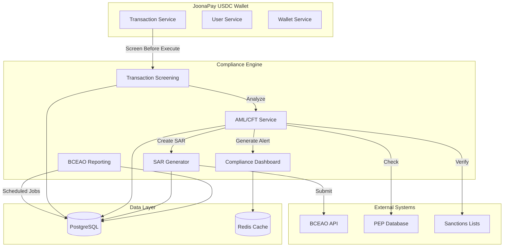

# BCEAO Compliance Engine - Architecture

## System Overview



## Service Architecture

### 1. BCEAO Reporting Service

**Responsibility**: Periodic regulatory report generation

```
┌─────────────────────────────────────┐
│   BCEAO Reporting Service           │
├─────────────────────────────────────┤
│ Scheduled Jobs:                     │
│  - Daily Report (00:00 WAT)         │
│  - Weekly Report (Sunday 00:00)     │
│  - Monthly Report (1st 00:00)       │
├─────────────────────────────────────┤
│ Functions:                          │
│  - generateReport()                 │
│  - calculateMetrics()               │
│  - identifyFlaggedTransactions()    │
│  - approveReport()                  │
│  - submitReport()                   │
│  - exportReport()                   │
└─────────────────────────────────────┘
         │
         ▼
┌─────────────────────────────────────┐
│  compliance_reports table           │
│  - Daily/Weekly/Monthly summaries   │
│  - Transaction volume metrics       │
│  - Cross-border tracking            │
│  - Submission status                │
└─────────────────────────────────────┘
```

### 2. AML/CFT Service

**Responsibility**: Real-time transaction analysis and pattern detection

```
┌─────────────────────────────────────┐
│   AML/CFT Service                   │
├─────────────────────────────────────┤
│ Real-time Analysis:                 │
│  - analyzeTransaction()             │
│  - checkVelocity()                  │
│  - detectStructuring()              │
│  - assessGeographicRisk()           │
│  - screenForPEP()                   │
├─────────────────────────────────────┤
│ Pattern Detection:                  │
│  - detectRapidMovement()            │
│  - detectRoundAmountPattern()       │
│  - runBatchAnalysis()               │
├─────────────────────────────────────┤
│ Alert Management:                   │
│  - createAlert()                    │
│  - acknowledgeAlert()               │
│  - resolveAlert()                   │
└─────────────────────────────────────┘
         │
         ▼
┌─────────────────────────────────────┐
│  compliance_alerts table            │
│  - Real-time risk alerts            │
│  - Officer acknowledgments          │
│  - Resolution tracking              │
└─────────────────────────────────────┘
```

### 3. SAR Generator Service

**Responsibility**: Suspicious Activity Report lifecycle management

```
┌─────────────────────────────────────┐
│   SAR Generator Service             │
├─────────────────────────────────────┤
│ SAR Creation:                       │
│  - createAutomatedSAR()             │
│  - createManualSAR()                │
│  - generateNarrative()              │
├─────────────────────────────────────┤
│ Investigation:                      │
│  - updateInvestigation()            │
│  - getSAR()                         │
│  - getUserSARHistory()              │
├─────────────────────────────────────┤
│ Filing:                             │
│  - submitSAR()                      │
│  - closeSAR()                       │
│  - exportSAR()                      │
└─────────────────────────────────────┘
         │
         ▼
┌─────────────────────────────────────┐
│  suspicious_activity_reports table  │
│  - SAR records with 7yr retention   │
│  - Investigation notes              │
│  - BCEAO submission tracking        │
└─────────────────────────────────────┘
```

### 4. Compliance Dashboard Service

**Responsibility**: Aggregated compliance metrics and monitoring

```
┌─────────────────────────────────────┐
│   Compliance Dashboard Service      │
├─────────────────────────────────────┤
│ Dashboard:                          │
│  - getDashboard()                   │
│  - getComplianceHealthScore()       │
│  - getRecentActivity()              │
│  - getPendingItems()                │
├─────────────────────────────────────┤
│ Analytics:                          │
│  - calculateRiskTrends()            │
│  - aggregateMetrics()               │
│  - exportComplianceSummary()        │
└─────────────────────────────────────┘
```

## Data Flow

### Transaction Screening Flow

```
User Initiates Transaction
         │
         ▼
┌─────────────────────────┐
│ Transaction Request     │
│ - userId                │
│ - amount                │
│ - recipient             │
└─────────────────────────┘
         │
         ▼
┌─────────────────────────┐
│ Screening Guard         │
│ (if enabled)            │
└─────────────────────────┘
         │
         ▼
┌─────────────────────────┐
│ AML/CFT Analysis        │
│ 1. Velocity check       │
│ 2. Structuring check    │
│ 3. Geographic risk      │
│ 4. PEP screening        │
│ 5. Pattern detection    │
└─────────────────────────┘
         │
         ▼
    Risk Score
    (0-100)
         │
    ┌────┴────┐
    │         │
    ▼         ▼
  Low/Med   High/Critical
    │         │
    │         ▼
    │    ┌─────────────┐
    │    │ Create Alert│
    │    └─────────────┘
    │         │
    │         ▼
    │    Risk Score >= 85?
    │         │
    │    ┌────┴────┐
    │    │         │
    │    ▼         ▼
    │   Yes       No
    │    │         │
    │    ▼         │
    │ ┌──────┐    │
    │ │ SAR  │    │
    │ └──────┘    │
    │             │
    ▼             ▼
Approve     Manual Review
         │
         ▼
   Execute Transaction
```

### SAR Lifecycle Flow

```
Detection
    │
    ▼
┌─────────────┐
│ DRAFT       │ ← Automated or manual creation
└─────────────┘
    │
    ▼
┌─────────────────────┐
│ UNDER_INVESTIGATION │ ← Officer assigned
└─────────────────────┘
    │
    ├──────────────┬────────────┐
    │              │            │
    ▼              ▼            ▼
┌──────────┐  ┌──────────┐  ┌──────────┐
│SUBMITTED │  │ CLOSED   │  │DISMISSED │
│to BCEAO  │  │Filed     │  │False pos │
└──────────┘  └──────────┘  └──────────┘
```

### Report Generation Flow

```
Scheduled Trigger (Cron)
         │
         ▼
┌──────────────────────┐
│ Fetch Transactions   │
│ - Query period range │
│ - Include all types  │
└──────────────────────┘
         │
         ▼
┌──────────────────────┐
│ Calculate Metrics    │
│ - Volume totals      │
│ - User counts        │
│ - Cross-border stats │
│ - Flag large TXs     │
└──────────────────────┘
         │
         ▼
┌──────────────────────┐
│ Create Report Entity │
│ - Status: DRAFT      │
│ - Store metrics      │
│ - Generate summary   │
└──────────────────────┘
         │
         ▼
┌──────────────────────┐
│ Manual Review        │
│ (Compliance Officer) │
└──────────────────────┘
         │
         ▼
┌──────────────────────┐
│ Approve & Submit     │
│ - BCEAO API call     │
│ - Get reference #    │
└──────────────────────┘
```

## Database Design

### Entity Relationships

```
users
  │
  ├──< transactions
  │      │
  │      └──> flagged_in: compliance_reports
  │
  ├──< suspicious_activity_reports
  │      │
  │      └──> bceao_reference
  │
  └──< compliance_alerts
         │
         └──> escalates_to: suspicious_activity_reports
```

### Indexes Strategy

**High-cardinality indexes:**
- `user_id` - User-based queries
- `created_at` - Time-based queries
- `status` - Status filtering

**Composite indexes:**
- `(report_type, period_start)` - Report queries
- `(user_id, created_at)` - User activity timeline
- `(status, severity)` - Alert prioritization

**JSONB indexes:**
```sql
CREATE INDEX idx_compliance_report_data_gin ON compliance_reports USING GIN (report_data);
CREATE INDEX idx_sar_pattern_indicators_gin ON suspicious_activity_reports USING GIN (pattern_indicators);
```

## Scaling Considerations

### Horizontal Scaling

**Stateless Design**: All services are stateless and can scale horizontally

**Cron Job Coordination**: Use distributed locks for scheduled jobs
```typescript
// Use Redis lock to ensure only one instance runs job
const lock = await redis.lock('compliance:daily-report', 60000);
if (lock) {
  await generateDailyReport();
  await lock.release();
}
```

### Performance Optimization

**Caching Strategy**:
- Risk scores: 5-minute TTL
- Geographic risk data: 24-hour TTL
- PEP screening results: 7-day TTL

**Batch Processing**:
- Process users in chunks of 100
- Use async queues for batch analysis
- Parallel processing where possible

**Database Optimization**:
- Partition large tables by date
- Archive old data to separate tables
- Use materialized views for dashboard metrics

### Load Distribution

```
┌──────────────┐     ┌──────────────┐     ┌──────────────┐
│  Instance 1  │     │  Instance 2  │     │  Instance 3  │
│              │     │              │     │              │
│ - API        │     │ - API        │     │ - Jobs Only  │
│ - Real-time  │     │ - Real-time  │     │ - Reports    │
│   screening  │     │   screening  │     │ - Batch      │
└──────────────┘     └──────────────┘     └──────────────┘
         │                   │                     │
         └───────────────────┴─────────────────────┘
                             │
                    ┌────────▼────────┐
                    │  Load Balancer  │
                    └─────────────────┘
```

## Security Architecture

### Access Control

```
┌─────────────────────────────────────────┐
│         Compliance Endpoints            │
└─────────────────────────────────────────┘
              │
              ▼
┌─────────────────────────────────────────┐
│      JWT Authentication Guard           │
└─────────────────────────────────────────┘
              │
              ▼
┌─────────────────────────────────────────┐
│      Role Authorization Guard           │
│  - admin                                │
│  - compliance_officer                   │
│  - senior_compliance_officer            │
└─────────────────────────────────────────┘
              │
              ▼
┌─────────────────────────────────────────┐
│      Audit Logging Interceptor          │
│  Log all compliance actions             │
└─────────────────────────────────────────┘
```

### Data Encryption

- **At Rest**: PostgreSQL encryption
- **In Transit**: TLS 1.3
- **PII Fields**: Application-level encryption for sensitive data
- **API Keys**: Stored in secure vault (AWS Secrets Manager / HashiCorp Vault)

### Audit Trail

All compliance actions logged:
```typescript
{
  timestamp: '2026-01-25T14:30:00Z',
  action: 'SAR_SUBMITTED',
  officerId: 'officer-uuid',
  resourceId: 'sar-uuid',
  resourceType: 'SAR',
  metadata: {
    bceaoReference: 'SAR-BCEAO-2026-01-00123',
    riskLevel: 'high'
  }
}
```

## Integration Points

### 1. Transaction Service

```typescript
@UseGuards(TransactionScreeningGuard)
@Post('transfer')
async createTransfer(@Body() dto: CreateTransferDto) {
  // Guard automatically screens transaction
  // Access assessment via request.complianceAssessment
  return this.transactionService.create(dto);
}
```

### 2. User Service

```typescript
async createUser(userData) {
  const user = await this.userRepository.save(userData);

  // Assess geographic risk
  const geoRisk = await this.amlCftService.assessGeographicRisk(
    user.countryCode
  );

  if (geoRisk.riskLevel === 'critical') {
    // Require enhanced due diligence
    await this.requireEnhancedKYC(user.id);
  }

  return user;
}
```

### 3. Notification Service

```typescript
@OnEvent('compliance.alert.created')
async notifyOfficers(payload) {
  if (payload.severity === 'critical') {
    await this.sendEmail({
      to: 'compliance@joonapay.com',
      subject: 'CRITICAL Compliance Alert',
      body: `Alert ${payload.alertId} requires immediate attention`
    });
  }
}
```

## API Endpoints Specification

### Report Endpoints

| Method | Endpoint | Description | Auth Required |
|--------|----------|-------------|---------------|
| GET | `/compliance/reports` | List reports | Admin |
| GET | `/compliance/reports/:id` | Get report details | Admin |
| POST | `/compliance/reports/generate` | Generate ad-hoc report | Compliance Officer |
| PUT | `/compliance/reports/:id/approve` | Approve report | Compliance Officer |
| POST | `/compliance/reports/:id/submit` | Submit to BCEAO | Senior Officer |
| GET | `/compliance/reports/:id/export` | Export report | Admin |

### SAR Endpoints

| Method | Endpoint | Description | Auth Required |
|--------|----------|-------------|---------------|
| GET | `/compliance/sars` | List SARs | Compliance Officer |
| GET | `/compliance/sars/:id` | Get SAR details | Compliance Officer |
| POST | `/compliance/sars` | Create manual SAR | Compliance Officer |
| PUT | `/compliance/sars/:id/investigation` | Update investigation | Compliance Officer |
| POST | `/compliance/sars/:id/submit` | Submit to BCEAO | Senior Officer |
| POST | `/compliance/sars/:id/close` | Close SAR | Compliance Officer |
| POST | `/compliance/sars/:id/dismiss` | Dismiss false positive | Compliance Officer |
| GET | `/compliance/sars/:id/export` | Export SAR | Senior Officer |

### Alert Endpoints

| Method | Endpoint | Description | Auth Required |
|--------|----------|-------------|---------------|
| GET | `/compliance/alerts` | List alerts | Compliance Officer |
| POST | `/compliance/alerts/:id/acknowledge` | Acknowledge alert | Compliance Officer |
| POST | `/compliance/alerts/:id/resolve` | Resolve alert | Compliance Officer |

### Risk Assessment Endpoints

| Method | Endpoint | Description | Auth Required |
|--------|----------|-------------|---------------|
| GET | `/compliance/users/:id/risk-profile` | Get user risk profile | Compliance Officer |
| POST | `/compliance/users/:id/analyze` | Analyze user patterns | Compliance Officer |
| POST | `/compliance/analysis/batch` | Run batch analysis | Admin |

## Technology Stack

### Core Technologies

- **Framework**: NestJS (Node.js/TypeScript)
- **Database**: PostgreSQL 14+ (JSONB support)
- **Cache**: Redis (risk score caching)
- **Scheduling**: `@nestjs/schedule` (node-cron)
- **Events**: `@nestjs/event-emitter`

### External Integrations

- **BCEAO API**: REST API (when available)
- **PEP Screening**: World-Check, Dow Jones, or ComplyAdvantage
- **Sanctions Lists**: OFAC, UN, EU automated updates
- **Exchange Rates**: Real-time XOF/USDC rates

### Development Tools

- **Testing**: Jest (unit & e2e)
- **API Docs**: Swagger/OpenAPI
- **Monitoring**: Prometheus + Grafana
- **Logging**: Winston + ELK Stack

## Performance Benchmarks

### Target Performance

| Operation | Target | Notes |
|-----------|--------|-------|
| Transaction screening | < 200ms | Real-time blocking |
| Risk profile lookup | < 100ms | Cached results |
| Daily report generation | < 5 min | Depends on transaction volume |
| Batch analysis (1000 users) | < 10 min | Background job |
| SAR export | < 1 sec | Formatted output |

### Resource Requirements

**CPU**: 2-4 cores per instance
**Memory**: 4-8 GB per instance
**Database**: 100-500 GB (depends on transaction volume)
**Cache**: 2-4 GB Redis

### Bottleneck Analysis

**Potential bottlenecks:**
1. **Batch analysis** - Process in chunks
2. **Large report generation** - Pagination and streaming
3. **PEP screening API** - Cache results, rate limit requests
4. **Database queries** - Proper indexing, query optimization

## Disaster Recovery

### Backup Strategy

- **Database**: Daily snapshots, 7-year retention
- **Compliance reports**: S3 archive with versioning
- **SARs**: Encrypted backup, multi-region replication

### Recovery Procedures

1. **Database corruption**: Restore from latest snapshot
2. **Report loss**: Regenerate from transaction history
3. **SAR data loss**: Restore from encrypted backup
4. **BCEAO submission failure**: Queue for retry with exponential backoff

## Monitoring & Alerts

### Key Metrics

```
compliance_reports_generated_total
compliance_reports_submitted_total
compliance_sars_created_total
compliance_sars_submitted_total
compliance_alerts_open_count
compliance_risk_score_avg
compliance_processing_time_seconds
```

### Alert Rules

- **Critical**: SAR older than 48 hours not submitted
- **High**: >10 unresolved critical alerts
- **Medium**: Report pending >24 hours
- **Low**: Batch analysis failure

## Compliance Workflow

### Daily Routine

**09:00 WAT** - Compliance Officer Morning Review
1. Check overnight alerts (critical first)
2. Review daily report (auto-generated at 00:00)
3. Investigate any high-risk patterns
4. Approve/submit pending reports

**12:00 WAT** - Midday Check
1. Review new alerts
2. Check SAR investigation progress
3. Respond to BCEAO queries (if any)

**17:00 WAT** - End of Day
1. Resolve remaining alerts
2. Update SAR investigation notes
3. Prepare next day's submissions

### Weekly Routine

**Monday Morning**:
1. Review weekly report (generated Sunday)
2. Trend analysis - compare to previous weeks
3. Adjust thresholds if needed
4. Team meeting - discuss patterns

### Monthly Routine

**First Week of Month**:
1. Review monthly report
2. Submit to BCEAO by 10th
3. Board reporting (if required)
4. Regulatory filing checklist
5. Archive previous month's data

## Future Architecture Enhancements

### 1. Microservices Split

```
compliance-api (REST)
    │
    ├─> compliance-screening-service (real-time)
    ├─> compliance-reporting-service (batch)
    ├─> compliance-analytics-service (ML)
    └─> compliance-storage-service (archival)
```

### 2. Event-Driven Architecture

```
Transaction Event → Kafka Topic → Compliance Consumer
                                       │
                                       ├─> Screen
                                       ├─> Log
                                       └─> Alert (if needed)
```

### 3. Machine Learning Integration

```
Transaction Features
    │
    ▼
Feature Engineering
    │
    ▼
ML Model (TensorFlow)
    │
    ▼
Risk Score Prediction
```

### 4. Graph Database for Network Analysis

```
Neo4j Graph Database
    │
    ├─> User → Transaction → User (transfer network)
    ├─> Identify clusters
    ├─> Detect mule accounts
    └─> Find hidden relationships
```
